# KLS progress

| View | Purpose |
| --- | --- |
| [BKL main proof chain](#bkl-main-proof-chain) | Short reading order, Lean entries and remaining inputs |
| [Literature register](LITERATURE.md) | **Primary progress view.** Paper by paper: target theorem, local Lean statements, local status and certificates |
| [Route diagrams](#proof-progress-tree) | Exploratory proof routes and the shared analytic infrastructure behind them |
| [Progress table](STATUS.md) | Local node IDs, mathematical provenance, recorded Lean status, certificates, dependencies, and gaps |

The project goal is to formalize as much of the published KLS literature as possible. Work is
selected by a named paper, pinned version and target theorem. The four routes in the diagram
below are exploratory research records that share our analytic infrastructure; they are not
formalization targets in their own right.

A paper is **covered** only when its main theorem is stated faithfully in Lean (same hypotheses,
constants, normalization and dimensional scope), proved without nonstandard axioms, and
registered with a certificate and verification evidence for that exact statement. Supporting
lemmas, restricted cases and conditional reductions do not cover a paper. Upstream mathematical
proofs and conditional arguments remain separate from local Lean proofs. KLS remains open.

<!-- BEGIN GENERATED COVERAGE -->
**Covered by a registered paper-target certificate: Bakry–Gentil–Ledoux (Corollary 4.8.2, p. 212), Ambrosio–Di Marino–Gigli (Theorem 3.6).**
<!-- END GENERATED COVERAGE -->

The current analytic frontier is summarized under [Proof progress tree](#proof-progress-tree):
the numerical π Cheeger–Buser comparison holds for every finite-dimensional log-concave law,
and metric BV relaxation and recovery are proved within their stated measure and space scope.

## BKL main proof chain

<!-- BEGIN GENERATED BKL -->
Pinned main source: [Bizeul–Klartag–Lehec, arXiv:2610.05474v1](https://arxiv.org/abs/2610.05474v1).

Read the conditional assembly first, then its analytic inputs and the remaining
Letwin/localization obligations. This is a reading order, not a new dependency graph.
Status comes from the existing paper lemma maps. A ✓ proves the displayed statement
with its hypotheses; it does not discharge an input or cover the whole paper.

| Source step | Lean entry | Local status | Input boundary / remaining work | Evidence |
| --- | --- | --- | --- | --- |
| [Bizeul–Klartag–Lehec: Theorem 1.1, p. 2](https://arxiv.org/abs/2610.05474v1) | [`FunctionalInequalities.KLS.conjecture_of_cumulantBound`](../../formalization/FunctionalInequalities/KLS/BKL/Reduction.lean) | ◐ Partial or statement only | Assembly is proved only under the universal cumulant input of Theorem 4.1. Theorem 1.1 and KLS remain open. | [Item map](LITERATURE.md#bkl2026-lemma-map) |
| [Bizeul–Klartag–Lehec: Theorem 3.1, p. 10](https://arxiv.org/abs/2610.05474v1) | [`Solutions.ThmBklTaylorCriterion.certificate`](../../solutions/ThmBklTaylorCriterion.lean) | ✓ Formalized in Lean | Source-form Taylor criterion for centered regular laws, covariance at most Id and the Taylor coefficient hypothesis. Operator route with an approximate first eigenfunction. | [Item map](LITERATURE.md#bkl2026-lemma-map)<br/>[Certificate](../../solutions/ThmBklTaylorCriterion.lean) |
| [Bizeul–Klartag–Lehec: Proposition 7.1, p. 28](https://arxiv.org/abs/2610.05474v1) | [`Solutions.PropBklSuspension.certificate`](../../solutions/PropBklSuspension.lean) | ✓ Formalized in Lean | Source-form suspension implication in all dimensions; CumulantBound d b is a retained premise supplied by the still-open Theorem 4.1. | [Item map](LITERATURE.md#bkl2026-lemma-map)<br/>[Certificate](../../solutions/PropBklSuspension.lean) |
| [Bizeul–Klartag–Lehec: Theorem 4.1, p. 18](https://arxiv.org/abs/2610.05474v1) | Supporting declarations in the item map | ◐ Partial or statement only | Universal cumulant estimate is open. Envelope/arithmetic supports do not supply the Eldan process, stochastic induction or compact-support/limit argument. | [Item map](LITERATURE.md#bkl2026-lemma-map) |
| [Bizeul–Klartag–Lehec: Lemma 4.3, p. 20](https://arxiv.org/abs/2610.05474v1) | [`FunctionalInequalities.Analysis.BakryEmery.iteratedFDeriv_inner_centeredGradient_zero_grouped_of_compact`](../../formalization/FunctionalInequalities/Analysis/BakryEmery/Cumulant/Leibniz.lean) | ◐ Partial or statement only | Only the deterministic spatial grouping (72)/(74) is proved. Eldan SDE, Ito dynamics and the stochastic integral in (73) remain open; vendor adoption is infrastructure. | [Item map](LITERATURE.md#bkl2026-lemma-map) |
| [Bizeul–Klartag–Lehec: Lemma 4.2, p. 18](https://arxiv.org/abs/2610.05474v1) | [`FunctionalInequalities.KLS.LogConcave.sum_sq_cumulant_three_le_of_letwin`](../../formalization/FunctionalInequalities/KLS/BKL/LocalThirdCumulant.lean) | ◐ Partial or statement only | Conditional source-scope counterpart retaining LetwinQuadraticBound; the constant-8 input is not discharged. | [Item map](LITERATURE.md#bkl2026-lemma-map) |
| [Letwin: Theorem 1.2](https://arxiv.org/abs/2607.24164v1) | [`FunctionalInequalities.KLS.Isotropic.covarianceBilin_map_sqrt_abs_matrix`](../../formalization/FunctionalInequalities/KLS/Isotropic.lean) | ◐ Partial or statement only | Covariance transport support is proved. The actual moment-map Stein kernel, identity (2.21), source reductions and the Var <= 8 &#124;&#124;M&#124;&#124;_HS^2 bound remain open. | [Item map](LITERATURE.md#letwin2026-lemma-map) |
| [Letwin: Theorem 2.5](https://arxiv.org/abs/2607.24164v1) | [`FunctionalInequalities.Analysis.symmetric_trace_integral_extension`](../../formalization/FunctionalInequalities/Analysis/Matrix/Integral.lean) | ◐ Partial or statement only | Matrix extension and given-potential cutoff, trace and scalar Brascamp-Lieb supports do not prove the source theorem. The actual moment map, its regularity and the integrated positive-semidefinite bound remain open. | [Item map](LITERATURE.md#letwin2026-lemma-map) |
| [Letwin: Lemma 2.1 (Cordero-Erausquin and Klartag [21, Theorem 2])](https://arxiv.org/abs/2607.24164v1) | No source-theorem entry | ○ Not yet formalized | Produce the moment potential of the source law and then the regularity of Lemma 2.2. A supplied potential or bounded-primal support is not the source-law construction. | [Item map](LITERATURE.md#letwin2026-lemma-map) |

Certificates and item maps identify statements and source reviews, not a fresh run.
For snapshot-specific acceptance use [verification](../verification.md#receipts-and-trust-scope)
and the [current handoff](../../HANDOFF.md). **BKL Theorem 1.1 and dimension-free KLS remain open.**
<!-- END GENERATED BKL -->

## Literature priorities

<!-- BEGIN GENERATED PRIORITIES -->
These are source-review and proof priorities, not claims that the targets are proved.
Every proof task must first pin its paper version, theorem, hypotheses and constants.

| Priority | Sources / target | Next action |
| --- | --- | --- |
| 1 | [Bizeul–Klartag–Lehec](https://arxiv.org/abs/2610.05474v1)<br/>Theorem 1.1 through Theorems 3.1 (certified, thm:bkl-taylor-criterion), 4.1 and Proposition 7.1 (certified in the source form, prop:bkl-suspension, conditional on its hypothesis CumulantBound): Section 3 is formalized by the operator route; Lemma 2.2, Lemma 3.6 (⇑), Corollary 3.7 (⇑), Lemmas 3.2–3.4, 3.8, 3.9 for the D(A) iterates (⇑), the regular-law adapter for (12), the complete Section 2 reduction to isotropic regular laws (regular approximation and weak-limit transfer) and the p. 30 reduction are formalized, so Theorem 1.1 is formalized conditionally on the Theorem 4.1 cumulant bounds (no certificate); Lemma 2.1 on 𝒜, (19), and Lemma 4.2 conditional on the Letwin bound are partial, restricted or conditional counterparts; the deterministic spatial step (74)/(72) of Lemma 4.3 is formalized (⇑); Theorem 4.1 is stated conditionally (cumulant envelope) and open. | Next: Stage 2, Letwin Theorem 1.2 (Var ≤ 8‖M‖²_HS, the exact input of Lemma 4.2), active under the renewed Codex controller. Stage 2A is formalized: Letwin Lemma A.4 for every source-class potential and every real R ≥ 1 with its natural-index C/(n+1) form, Lemma A.5 for given cutoffs, and their application to the nonconstant uniform-interval potential client (its pushforward to the uniform law is not proved; not the general moment-map producer). This supports, but does not prove, Letwin Theorem 2.5, Theorem 1.2 or an unconditional BKL Lemma 4.2. Next within Stage 2: Letwin Theorem 2.5 with Proposition 2.8 and the Stein-kernel identity (2.21), toward Theorem 1.2. Stage 1 (BKL (74) grouped with (72); the covariance step of the proof of Letwin Theorem 1.2) is integrated and covered by the full local receipt 20261010T093056.948739Z. Owner scope (2026-10-10): BKL Theorem 1.1 is the primary objective. Discharge Theorem 4.1 through the original Eldan localization and the Section 4-6 cumulant-energy argument, and the cited Letwin Theorem 1.2 input for Lemma 4.2. Reuse the certified Theorem 3.1, conditional source Proposition 7.1 and regular-law reduction. Other papers are pursued only for referenced results and necessary prerequisites with an explicit BKL consumer; general CEK Theorem 2/uniqueness and full Letwin paper coverage are not standalone goals. Moment-potential, regularity, Stein, integration and approximation work must be tied to the required Letwin bound. Conditional assembly remains insufficient; KLS.kls stays open. |
| 2 | [Bakry–Gentil–Ledoux](https://link.springer.com/book/10.1007/978-3-319-00227-9)<br/>Corollary 4.8.2 (strongly log-concave Bakry–Émery C_P ≤ 1/ρ) is certified as thm:bakry-emery-poincare and committed in 36e7c78 (remote run 37516844384 succeeded); select a separate Brascamp–Lieb source statement. | Deferred as an independent paper target under the 2026-10-10 BKL-first scope. Resume only for a reviewed referenced result or necessary prerequisite with an explicit BKL proof consumer; existing formalization and certificates are retained. |
| 3 | [Kannan–Lovász–Simonovits](https://link.springer.com/article/10.1007/BF02574061)<br/>Theorem 5.1, ψ(K) ≥ ln 2 / M₁(K) for convex bodies, through the needle reduction (Corollary 2.2, Lemma 2.6, Theorem 2.7). With the local Cheeger inequality it gives C_P ≲ E‖X − EX‖² for convex bodies. | Deferred as an independent paper target under the 2026-10-10 BKL-first scope. Resume only for a reviewed referenced result or necessary prerequisite with an explicit BKL proof consumer; existing formalization and certificates are retained. |
| 4 | [E. Milman](https://arxiv.org/abs/0712.4092)<br/>Concentration implies a Cheeger bound under the source convexity hypotheses. | Deferred as an independent paper target under the 2026-10-10 BKL-first scope. Resume only for a reviewed referenced result or necessary prerequisite with an explicit BKL proof consumer; existing formalization and certificates are retained. |
| 5 | [Eldan](https://arxiv.org/abs/1203.0893), [Lee–Vempala](https://annals.math.princeton.edu/2024/199-3/p02), [Chen](https://arxiv.org/abs/2011.13661), [Klartag–Lehec](https://arxiv.org/html/2203.15551v2), [Klartag](https://arxiv.org/html/2303.14938v2)<br/>Published stochastic-localization theorems and quantitative KLS bounds. | Deferred as an independent paper target under the 2026-10-10 BKL-first scope. Resume only for a reviewed referenced result or necessary prerequisite with an explicit BKL proof consumer; existing formalization and certificates are retained. |
| 6 | [Klartag–Lehec](https://arxiv.org/abs/2507.15495v2), [Chen–Klartag](https://arxiv.org/html/2607.23307v1), [Letwin](https://arxiv.org/html/2607.24164v1)<br/>Selected 2025–2026 thin-shell and quadratic-form results. | Deferred as an independent paper target under the 2026-10-10 BKL-first scope. Resume only for a reviewed referenced result or necessary prerequisite with an explicit BKL proof consumer; existing formalization and certificates are retained. |
<!-- END GENERATED PRIORITIES -->

## Paper lemma map

Numbered statements of the reviewed papers, with the same Lean status notation as the route
diagrams. Full tables, sources and notes are in the [paper register](LITERATURE.md#paper-lemma-maps).

<!-- BEGIN GENERATED LEMMAS -->
Each diagram shows a paper's main theorem (thick border, rightmost) with the statements its
proof uses, plus every statement with local Lean progress. Arrows run from a statement to
the results that use it. Full maps, statements and notes are in the paper register.

✓ Formalized in Lean · ◐ Partial or statement only · ○ Not yet formalized · ⇑ Stronger result or alternative route

### Kannan–Lovász–Simonovits (Discrete Comput. Geom. 13 (1995), 541–559)

15 statements: 15 ○. [Full map](LITERATURE.md#kls1995-lemma-map).

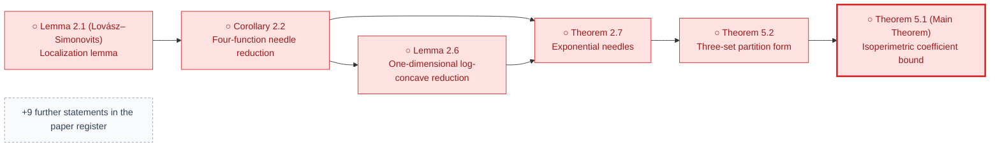
```mermaid
flowchart LR
    KLS1995_L21["○ Lemma 2.1 (Lovász–Simonovits)<br/>Localization lemma"]
    KLS1995_C22["○ Corollary 2.2<br/>Four-function needle reduction"]
    KLS1995_L26["○ Lemma 2.6<br/>One-dimensional log-concave reduction"]
    KLS1995_T27["○ Theorem 2.7<br/>Exponential needles"]
    KLS1995_T51["○ Theorem 5.1 (Main Theorem)<br/>Isoperimetric coefficient bound"]
    KLS1995_T52["○ Theorem 5.2<br/>Three-set partition form"]
    KLS1995_L21 --> KLS1995_C22
    KLS1995_C22 --> KLS1995_L26
    KLS1995_C22 --> KLS1995_T27
    KLS1995_L26 --> KLS1995_T27
    KLS1995_T52 --> KLS1995_T51
    KLS1995_T27 --> KLS1995_T52
    KLS1995_more["+9 further statements in the paper register"]
    classDef lemma_pending fill:#fee2e2,stroke:#dc2626,color:#991b1b;
    class KLS1995_L21,KLS1995_C22,KLS1995_L26,KLS1995_T27,KLS1995_T51,KLS1995_T52 lemma_pending;
    style KLS1995_T51 stroke-width:3px
    classDef lemma_more fill:#f8fafc,stroke:#94a3b8,color:#334155,stroke-dasharray:4 3;
    class KLS1995_more lemma_more;
```

### Bobkov (Ann. Probab. 27 (1999), no. 4, 1903–1921 (author PDF))

15 statements: 1 ✓, 1 ◐, 12 ○, 1 ⇑. [Full map](LITERATURE.md#bobkov1999-lemma-map).

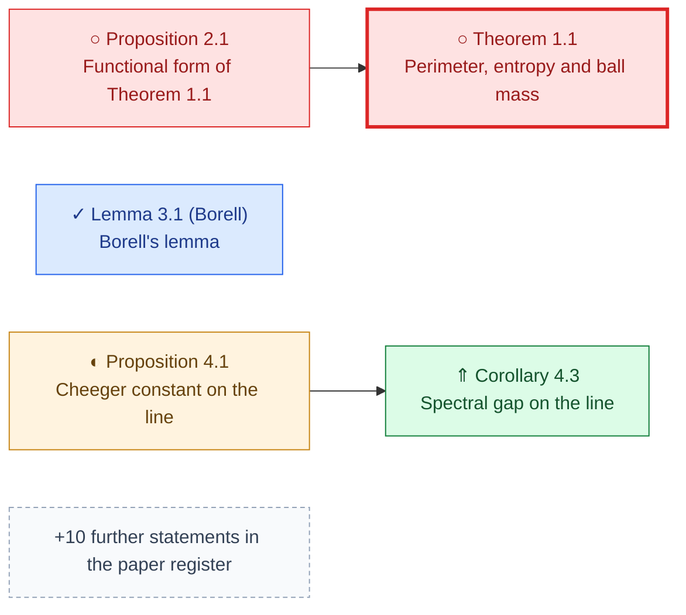
```mermaid
flowchart LR
    Bobkov1999_T11["○ Theorem 1.1<br/>Perimeter, entropy and ball mass"]
    Bobkov1999_P21["○ Proposition 2.1<br/>Functional form of Theorem 1.1"]
    Bobkov1999_L31["✓ Lemma 3.1 (Borell)<br/>Borell's lemma"]
    Bobkov1999_P41["◐ Proposition 4.1<br/>Cheeger constant on the line"]
    Bobkov1999_C43["⇑ Corollary 4.3<br/>Spectral gap on the line"]
    Bobkov1999_P21 --> Bobkov1999_T11
    Bobkov1999_P41 --> Bobkov1999_C43
    Bobkov1999_more["+10 further statements in the paper register"]
    classDef lemma_formalized fill:#dbeafe,stroke:#2563eb,color:#1e3a8a;
    class Bobkov1999_L31 lemma_formalized;
    classDef lemma_partial fill:#fff3df,stroke:#c88719,color:#66420d;
    class Bobkov1999_P41 lemma_partial;
    classDef lemma_pending fill:#fee2e2,stroke:#dc2626,color:#991b1b;
    class Bobkov1999_T11,Bobkov1999_P21 lemma_pending;
    classDef lemma_improved fill:#dcfce7,stroke:#15803d,color:#14532d;
    class Bobkov1999_C43 lemma_improved;
    style Bobkov1999_T11 stroke-width:3px
    classDef lemma_more fill:#f8fafc,stroke:#94a3b8,color:#334155,stroke-dasharray:4 3;
    class Bobkov1999_more lemma_more;
```

### E. Milman (arXiv:0712.4092v5)

60 statements: 2 ✓, 7 ◐, 51 ○. [Full map](LITERATURE.md#milman2009-lemma-map).

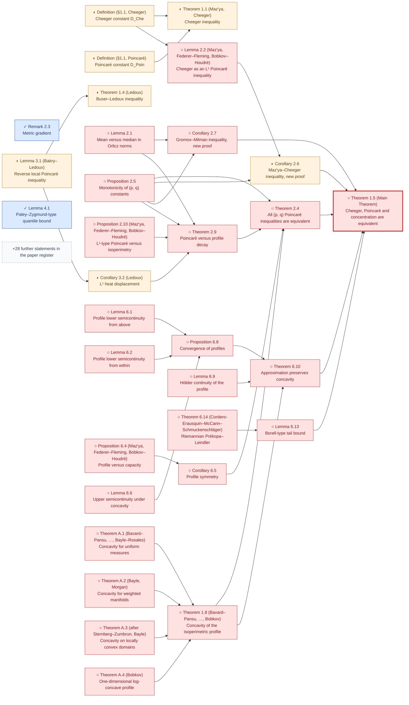
```mermaid
flowchart LR
    Milman2009_DChe["◐ Definition (§1.1, Cheeger)<br/>Cheeger constant D_Che"]
    Milman2009_DPoin["◐ Definition (§1.1, Poincaré)<br/>Poincaré constant D_Poin"]
    Milman2009_T11["◐ Theorem 1.1 (Maz'ya, Cheeger)<br/>Cheeger inequality"]
    Milman2009_T14["◐ Theorem 1.4 (Ledoux)<br/>Buser–Ledoux inequality"]
    Milman2009_T15["○ Theorem 1.5 (Main Theorem)<br/>Cheeger, Poincaré and concentration are equivalent"]
    Milman2009_T18["○ Theorem 1.8 (Bavard–Pansu, …, Bobkov)<br/>Concavity of the isoperimetric profile"]
    Milman2009_L21["○ Lemma 2.1<br/>Mean versus median in Orlicz norms"]
    Milman2009_L22["○ Lemma 2.2 (Maz'ya, Federer–Fleming, Bobkov–Houdré)<br/>Cheeger as an L¹ Poincaré inequality"]
    Milman2009_R23["✓ Remark 2.3<br/>Metric gradient"]
    Milman2009_T24["○ Theorem 2.4<br/>All (p, q) Poincaré inequalities are equivalent"]
    Milman2009_P25["○ Proposition 2.5<br/>Monotonicity of (p, q) constants"]
    Milman2009_C26["◐ Corollary 2.6<br/>Maz'ya–Cheeger inequality, new proof"]
    Milman2009_C27["○ Corollary 2.7<br/>Gromov–Milman inequality, new proof"]
    Milman2009_T29["○ Theorem 2.9<br/>Poincaré versus profile decay"]
    Milman2009_P210["○ Proposition 2.10 (Maz'ya, Federer–Fleming, Bobkov–Houdré)<br/>L¹-type Poincaré versus isoperimetry"]
    Milman2009_L31["◐ Lemma 3.1 (Bakry–Ledoux)<br/>Reverse local Poincaré inequality"]
    Milman2009_C32["◐ Corollary 3.2 (Ledoux)<br/>L¹ heat displacement"]
    Milman2009_L41["✓ Lemma 4.1<br/>Paley–Zygmund-type quantile bound"]
    Milman2009_L61["○ Lemma 6.1<br/>Profile lower semicontinuity from above"]
    Milman2009_L62["○ Lemma 6.2<br/>Profile lower semicontinuity from within"]
    Milman2009_P64["○ Proposition 6.4 (Maz'ya, Federer–Fleming, Bobkov–Houdré)<br/>Profile versus capacity"]
    Milman2009_C65["○ Corollary 6.5<br/>Profile symmetry"]
    Milman2009_L66["○ Lemma 6.6<br/>Upper semicontinuity under concavity"]
    Milman2009_P68["○ Proposition 6.8<br/>Convergence of profiles"]
    Milman2009_L69["○ Lemma 6.9<br/>Hölder continuity of the profile"]
    Milman2009_T610["○ Theorem 6.10<br/>Approximation preserves concavity"]
    Milman2009_L613["○ Lemma 6.13<br/>Borell-type tail bound"]
    Milman2009_T614["○ Theorem 6.14 (Cordero-Erausquin–McCann–Schmuckenschläger)<br/>Riemannian Prékopa–Leindler"]
    Milman2009_TA1["○ Theorem A.1 (Bavard–Pansu, …, Bayle–Rosales)<br/>Concavity for uniform measures"]
    Milman2009_TA2["○ Theorem A.2 (Bayle, Morgan)<br/>Concavity for weighted manifolds"]
    Milman2009_TA3["○ Theorem A.3 (after Sternberg–Zumbrun, Bayle)<br/>Concavity on locally convex domains"]
    Milman2009_TA4["○ Theorem A.4 (Bobkov)<br/>One-dimensional log-concave profile"]
    Milman2009_DChe --> Milman2009_T11
    Milman2009_DPoin --> Milman2009_T11
    Milman2009_L31 --> Milman2009_T14
    Milman2009_T24 --> Milman2009_T15
    Milman2009_C26 --> Milman2009_T15
    Milman2009_C27 --> Milman2009_T15
    Milman2009_T610 --> Milman2009_T15
    Milman2009_L613 --> Milman2009_T15
    Milman2009_TA1 --> Milman2009_T18
    Milman2009_TA2 --> Milman2009_T18
    Milman2009_TA3 --> Milman2009_T18
    Milman2009_TA4 --> Milman2009_T18
    Milman2009_DChe --> Milman2009_L22
    Milman2009_T29 --> Milman2009_T24
    Milman2009_T18 --> Milman2009_T24
    Milman2009_P25 --> Milman2009_T24
    Milman2009_C65 --> Milman2009_T24
    Milman2009_P25 --> Milman2009_C26
    Milman2009_L22 --> Milman2009_C26
    Milman2009_L21 --> Milman2009_C27
    Milman2009_P25 --> Milman2009_C27
    Milman2009_C32 --> Milman2009_T29
    Milman2009_L21 --> Milman2009_T29
    Milman2009_P25 --> Milman2009_T29
    Milman2009_P210 --> Milman2009_T29
    Milman2009_L31 --> Milman2009_C32
    Milman2009_P64 --> Milman2009_C65
    Milman2009_L61 --> Milman2009_P68
    Milman2009_L62 --> Milman2009_P68
    Milman2009_L66 --> Milman2009_P68
    Milman2009_P68 --> Milman2009_T610
    Milman2009_L69 --> Milman2009_T610
    Milman2009_T18 --> Milman2009_T610
    Milman2009_T614 --> Milman2009_L613
    Milman2009_more["+28 further statements in the paper register"]
    classDef lemma_formalized fill:#dbeafe,stroke:#2563eb,color:#1e3a8a;
    class Milman2009_R23,Milman2009_L41 lemma_formalized;
    classDef lemma_partial fill:#fff3df,stroke:#c88719,color:#66420d;
    class Milman2009_DChe,Milman2009_DPoin,Milman2009_T11,Milman2009_T14,Milman2009_C26,Milman2009_L31,Milman2009_C32 lemma_partial;
    classDef lemma_pending fill:#fee2e2,stroke:#dc2626,color:#991b1b;
    class Milman2009_T15,Milman2009_T18,Milman2009_L21,Milman2009_L22,Milman2009_T24,Milman2009_P25,Milman2009_C27,Milman2009_T29,Milman2009_P210,Milman2009_L61,Milman2009_L62,Milman2009_P64,Milman2009_C65,Milman2009_L66,Milman2009_P68,Milman2009_L69,Milman2009_T610,Milman2009_L613,Milman2009_T614,Milman2009_TA1,Milman2009_TA2,Milman2009_TA3,Milman2009_TA4 lemma_pending;
    style Milman2009_T15 stroke-width:3px
    classDef lemma_more fill:#f8fafc,stroke:#94a3b8,color:#334155,stroke-dasharray:4 3;
    class Milman2009_more lemma_more;
```

### Guédon–Milman (arXiv:1011.0943v3)

21 statements: 3 ✓, 1 ◐, 17 ○. [Full map](LITERATURE.md#guedonmilman2011-lemma-map).

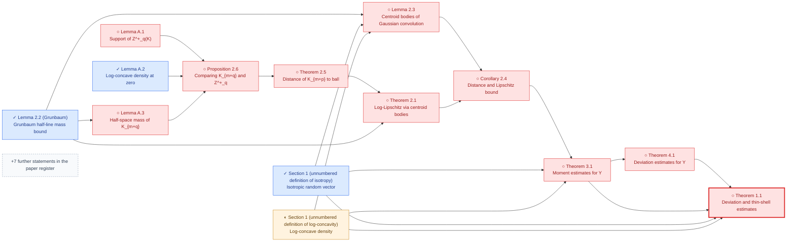
```mermaid
flowchart LR
    GuedonMilman2011_DISO["✓ Section 1 (unnumbered definition of isotropy)<br/>Isotropic random vector"]
    GuedonMilman2011_DLC["◐ Section 1 (unnumbered definition of log-concavity)<br/>Log-concave density"]
    GuedonMilman2011_T11["○ Theorem 1.1<br/>Deviation and thin-shell estimates"]
    GuedonMilman2011_T21["○ Theorem 2.1<br/>Log-Lipschitz via centroid bodies"]
    GuedonMilman2011_L22["✓ Lemma 2.2 (Grunbaum)<br/>Grunbaum half-line mass bound"]
    GuedonMilman2011_L23["○ Lemma 2.3<br/>Centroid bodies of Gaussian convolution"]
    GuedonMilman2011_C24["○ Corollary 2.4<br/>Distance and Lipschitz bound"]
    GuedonMilman2011_T25["○ Theorem 2.5<br/>Distance of K_{m+p} to ball"]
    GuedonMilman2011_P26["○ Proposition 2.6<br/>Comparing K_{m+q} and Z^+_q"]
    GuedonMilman2011_T31["○ Theorem 3.1<br/>Moment estimates for Y"]
    GuedonMilman2011_T41["○ Theorem 4.1<br/>Deviation estimates for Y"]
    GuedonMilman2011_A1["○ Lemma A.1<br/>Support of Z^+_q(K)"]
    GuedonMilman2011_A2["✓ Lemma A.2<br/>Log-concave density at zero"]
    GuedonMilman2011_A3["○ Lemma A.3<br/>Half-space mass of K_{m+q}"]
    GuedonMilman2011_T41 --> GuedonMilman2011_T11
    GuedonMilman2011_T31 --> GuedonMilman2011_T11
    GuedonMilman2011_DISO --> GuedonMilman2011_T11
    GuedonMilman2011_DLC --> GuedonMilman2011_T11
    GuedonMilman2011_T25 --> GuedonMilman2011_T21
    GuedonMilman2011_L22 --> GuedonMilman2011_T21
    GuedonMilman2011_L22 --> GuedonMilman2011_L23
    GuedonMilman2011_DISO --> GuedonMilman2011_L23
    GuedonMilman2011_DLC --> GuedonMilman2011_L23
    GuedonMilman2011_L23 --> GuedonMilman2011_C24
    GuedonMilman2011_T21 --> GuedonMilman2011_C24
    GuedonMilman2011_P26 --> GuedonMilman2011_T25
    GuedonMilman2011_A1 --> GuedonMilman2011_P26
    GuedonMilman2011_A2 --> GuedonMilman2011_P26
    GuedonMilman2011_A3 --> GuedonMilman2011_P26
    GuedonMilman2011_C24 --> GuedonMilman2011_T31
    GuedonMilman2011_DISO --> GuedonMilman2011_T31
    GuedonMilman2011_DLC --> GuedonMilman2011_T31
    GuedonMilman2011_T31 --> GuedonMilman2011_T41
    GuedonMilman2011_L22 --> GuedonMilman2011_A3
    GuedonMilman2011_more["+7 further statements in the paper register"]
    classDef lemma_formalized fill:#dbeafe,stroke:#2563eb,color:#1e3a8a;
    class GuedonMilman2011_DISO,GuedonMilman2011_L22,GuedonMilman2011_A2 lemma_formalized;
    classDef lemma_partial fill:#fff3df,stroke:#c88719,color:#66420d;
    class GuedonMilman2011_DLC lemma_partial;
    classDef lemma_pending fill:#fee2e2,stroke:#dc2626,color:#991b1b;
    class GuedonMilman2011_T11,GuedonMilman2011_T21,GuedonMilman2011_L23,GuedonMilman2011_C24,GuedonMilman2011_T25,GuedonMilman2011_P26,GuedonMilman2011_T31,GuedonMilman2011_T41,GuedonMilman2011_A1,GuedonMilman2011_A3 lemma_pending;
    style GuedonMilman2011_T11 stroke-width:3px
    classDef lemma_more fill:#f8fafc,stroke:#94a3b8,color:#334155,stroke-dasharray:4 3;
    class GuedonMilman2011_more lemma_more;
```

### Eldan (arXiv:1203.0893v5)

28 statements: 28 ○. [Full map](LITERATURE.md#eldan2013-lemma-map).

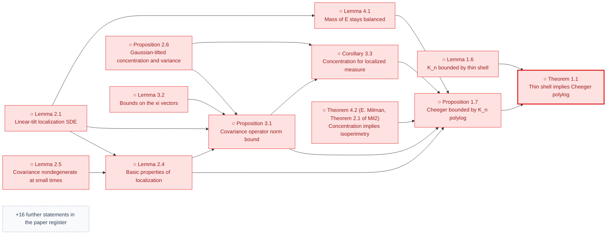
```mermaid
flowchart LR
    Eldan2013_T11["○ Theorem 1.1<br/>Thin shell implies Cheeger polylog"]
    Eldan2013_L16["○ Lemma 1.6<br/>K_n bounded by thin shell"]
    Eldan2013_P17["○ Proposition 1.7<br/>Cheeger bounded by K_n polylog"]
    Eldan2013_L21["○ Lemma 2.1<br/>Linear-tilt localization SDE"]
    Eldan2013_L24["○ Lemma 2.4<br/>Basic properties of localization"]
    Eldan2013_L25["○ Lemma 2.5<br/>Covariance nondegenerate at small times"]
    Eldan2013_P26["○ Proposition 2.6<br/>Gaussian-tilted concentration and variance"]
    Eldan2013_P31["○ Proposition 3.1<br/>Covariance operator norm bound"]
    Eldan2013_L32["○ Lemma 3.2<br/>Bounds on the xi vectors"]
    Eldan2013_C33["○ Corollary 3.3<br/>Concentration for localized measure"]
    Eldan2013_L41["○ Lemma 4.1<br/>Mass of E stays balanced"]
    Eldan2013_T42["○ Theorem 4.2 (E. Milman, Theorem 2.1 of Mil2)<br/>Concentration implies isoperimetry"]
    Eldan2013_L16 --> Eldan2013_T11
    Eldan2013_P17 --> Eldan2013_T11
    Eldan2013_L24 --> Eldan2013_P17
    Eldan2013_P31 --> Eldan2013_P17
    Eldan2013_C33 --> Eldan2013_P17
    Eldan2013_L41 --> Eldan2013_P17
    Eldan2013_T42 --> Eldan2013_P17
    Eldan2013_L21 --> Eldan2013_L24
    Eldan2013_L25 --> Eldan2013_L24
    Eldan2013_L21 --> Eldan2013_P31
    Eldan2013_L24 --> Eldan2013_P31
    Eldan2013_L32 --> Eldan2013_P31
    Eldan2013_P26 --> Eldan2013_P31
    Eldan2013_P26 --> Eldan2013_C33
    Eldan2013_P31 --> Eldan2013_C33
    Eldan2013_L21 --> Eldan2013_L41
    Eldan2013_more["+16 further statements in the paper register"]
    classDef lemma_pending fill:#fee2e2,stroke:#dc2626,color:#991b1b;
    class Eldan2013_T11,Eldan2013_L16,Eldan2013_P17,Eldan2013_L21,Eldan2013_L24,Eldan2013_L25,Eldan2013_P26,Eldan2013_P31,Eldan2013_L32,Eldan2013_C33,Eldan2013_L41,Eldan2013_T42 lemma_pending;
    style Eldan2013_T11 stroke-width:3px
    classDef lemma_more fill:#f8fafc,stroke:#94a3b8,color:#334155,stroke-dasharray:4 3;
    class Eldan2013_more lemma_more;
```

### Ambrosio–Gigli–Savaré (arXiv:1111.3730v3)

38 statements: 2 ✓, 3 ◐, 33 ○. [Full map](LITERATURE.md#ags2013-lemma-map).

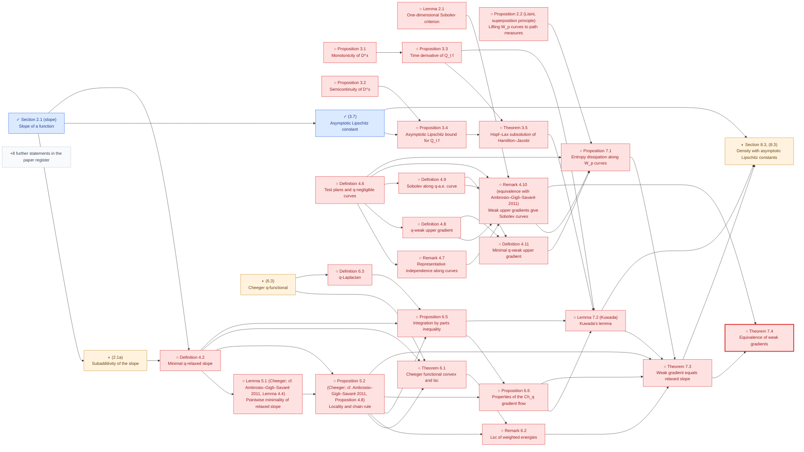
```mermaid
flowchart LR
    AGS2013_S21["✓ Section 2.1 (slope)<br/>Slope of a function"]
    AGS2013_E21a["◐ (2.1a)<br/>Subadditivity of the slope"]
    AGS2013_L21["○ Lemma 2.1<br/>One-dimensional Sobolev criterion"]
    AGS2013_P22["○ Proposition 2.2 (Lisini, superposition principle)<br/>Lifting W_p curves to path measures"]
    AGS2013_P31["○ Proposition 3.1<br/>Monotonicity of D^±"]
    AGS2013_P32["○ Proposition 3.2<br/>Semicontinuity of D^±"]
    AGS2013_P33["○ Proposition 3.3<br/>Time derivative of Q_t f"]
    AGS2013_E37["✓ (3.7)<br/>Asymptotic Lipschitz constant"]
    AGS2013_P34["○ Proposition 3.4<br/>Asymptotic Lipschitz bound for Q_t f"]
    AGS2013_T35["○ Theorem 3.5<br/>Hopf–Lax subsolution of Hamilton–Jacobi"]
    AGS2013_D42["○ Definition 4.2<br/>Minimal q-relaxed slope"]
    AGS2013_D46["○ Definition 4.6<br/>Test plans and q-negligible curves"]
    AGS2013_R47["○ Remark 4.7<br/>Representative independence along curves"]
    AGS2013_D48["○ Definition 4.8<br/>q-weak upper gradient"]
    AGS2013_D49["○ Definition 4.9<br/>Sobolev along q-a.e. curve"]
    AGS2013_R410["○ Remark 4.10 (equivalence with Ambrosio–Gigli–Savaré 2011)<br/>Weak upper gradients give Sobolev curves"]
    AGS2013_D411["○ Definition 4.11<br/>Minimal q-weak upper gradient"]
    AGS2013_L51["○ Lemma 5.1 (Cheeger; cf. Ambrosio–Gigli–Savaré 2011, Lemma 4.4)<br/>Pointwise minimality of relaxed slope"]
    AGS2013_P52["○ Proposition 5.2 (Cheeger; cf. Ambrosio–Gigli–Savaré 2011, Proposition 4.8)<br/>Locality and chain rule"]
    AGS2013_E63["◐ (6.3)<br/>Cheeger q-functional"]
    AGS2013_T61["○ Theorem 6.1<br/>Cheeger functional convex and lsc"]
    AGS2013_R62["○ Remark 6.2<br/>Lsc of weighted energies"]
    AGS2013_D63["○ Definition 6.3<br/>q-Laplacian"]
    AGS2013_P65["○ Proposition 6.5<br/>Integration by parts inequality"]
    AGS2013_P66["○ Proposition 6.6<br/>Properties of the Ch_q gradient flow"]
    AGS2013_P71["○ Proposition 7.1<br/>Entropy dissipation along W_p curves"]
    AGS2013_L72["○ Lemma 7.2 (Kuwada)<br/>Kuwada's lemma"]
    AGS2013_T73["○ Theorem 7.3<br/>Weak gradient equals relaxed slope"]
    AGS2013_T74["○ Theorem 7.4<br/>Equivalence of weak gradients"]
    AGS2013_S83["◐ Section 8.3, (8.3)<br/>Density with asymptotic Lipschitz constants"]
    AGS2013_S21 --> AGS2013_E21a
    AGS2013_P31 --> AGS2013_P33
    AGS2013_S21 --> AGS2013_E37
    AGS2013_P32 --> AGS2013_P34
    AGS2013_E37 --> AGS2013_P34
    AGS2013_P33 --> AGS2013_T35
    AGS2013_P34 --> AGS2013_T35
    AGS2013_S21 --> AGS2013_D42
    AGS2013_E21a --> AGS2013_D42
    AGS2013_D46 --> AGS2013_R47
    AGS2013_D46 --> AGS2013_D48
    AGS2013_D46 --> AGS2013_D49
    AGS2013_L21 --> AGS2013_R410
    AGS2013_D46 --> AGS2013_R410
    AGS2013_R47 --> AGS2013_R410
    AGS2013_D48 --> AGS2013_R410
    AGS2013_D49 --> AGS2013_R410
    AGS2013_D48 --> AGS2013_D411
    AGS2013_D49 --> AGS2013_D411
    AGS2013_D42 --> AGS2013_L51
    AGS2013_D42 --> AGS2013_P52
    AGS2013_L51 --> AGS2013_P52
    AGS2013_D42 --> AGS2013_T61
    AGS2013_E63 --> AGS2013_T61
    AGS2013_P52 --> AGS2013_T61
    AGS2013_T61 --> AGS2013_R62
    AGS2013_P52 --> AGS2013_R62
    AGS2013_E63 --> AGS2013_D63
    AGS2013_D63 --> AGS2013_P65
    AGS2013_P52 --> AGS2013_P65
    AGS2013_D42 --> AGS2013_P65
    AGS2013_P65 --> AGS2013_P66
    AGS2013_P52 --> AGS2013_P66
    AGS2013_P22 --> AGS2013_P71
    AGS2013_D46 --> AGS2013_P71
    AGS2013_R410 --> AGS2013_P71
    AGS2013_D411 --> AGS2013_P71
    AGS2013_P33 --> AGS2013_L72
    AGS2013_T35 --> AGS2013_L72
    AGS2013_P65 --> AGS2013_L72
    AGS2013_P66 --> AGS2013_L72
    AGS2013_P66 --> AGS2013_T73
    AGS2013_L72 --> AGS2013_T73
    AGS2013_P71 --> AGS2013_T73
    AGS2013_R62 --> AGS2013_T73
    AGS2013_P52 --> AGS2013_T73
    AGS2013_T73 --> AGS2013_T74
    AGS2013_R410 --> AGS2013_T74
    AGS2013_T73 --> AGS2013_S83
    AGS2013_L72 --> AGS2013_S83
    AGS2013_E37 --> AGS2013_S83
    AGS2013_more["+8 further statements in the paper register"]
    classDef lemma_formalized fill:#dbeafe,stroke:#2563eb,color:#1e3a8a;
    class AGS2013_S21,AGS2013_E37 lemma_formalized;
    classDef lemma_partial fill:#fff3df,stroke:#c88719,color:#66420d;
    class AGS2013_E21a,AGS2013_E63,AGS2013_S83 lemma_partial;
    classDef lemma_pending fill:#fee2e2,stroke:#dc2626,color:#991b1b;
    class AGS2013_L21,AGS2013_P22,AGS2013_P31,AGS2013_P32,AGS2013_P33,AGS2013_P34,AGS2013_T35,AGS2013_D42,AGS2013_D46,AGS2013_R47,AGS2013_D48,AGS2013_D49,AGS2013_R410,AGS2013_D411,AGS2013_L51,AGS2013_P52,AGS2013_T61,AGS2013_R62,AGS2013_D63,AGS2013_P65,AGS2013_P66,AGS2013_P71,AGS2013_L72,AGS2013_T73,AGS2013_T74 lemma_pending;
    style AGS2013_T74 stroke-width:3px
    classDef lemma_more fill:#f8fafc,stroke:#94a3b8,color:#334155,stroke-dasharray:4 3;
    class AGS2013_more lemma_more;
```

### Bakry–Gentil–Ledoux (Springer 2014, Grundlehren der mathematischen Wissenschaften 348 (DOI 10.1007/978-3-319-00227-9), Chapter 4)

46 statements: 6 ◐, 39 ○, 1 ⇑. [Full map](LITERATURE.md#bgl2014-lemma-map).

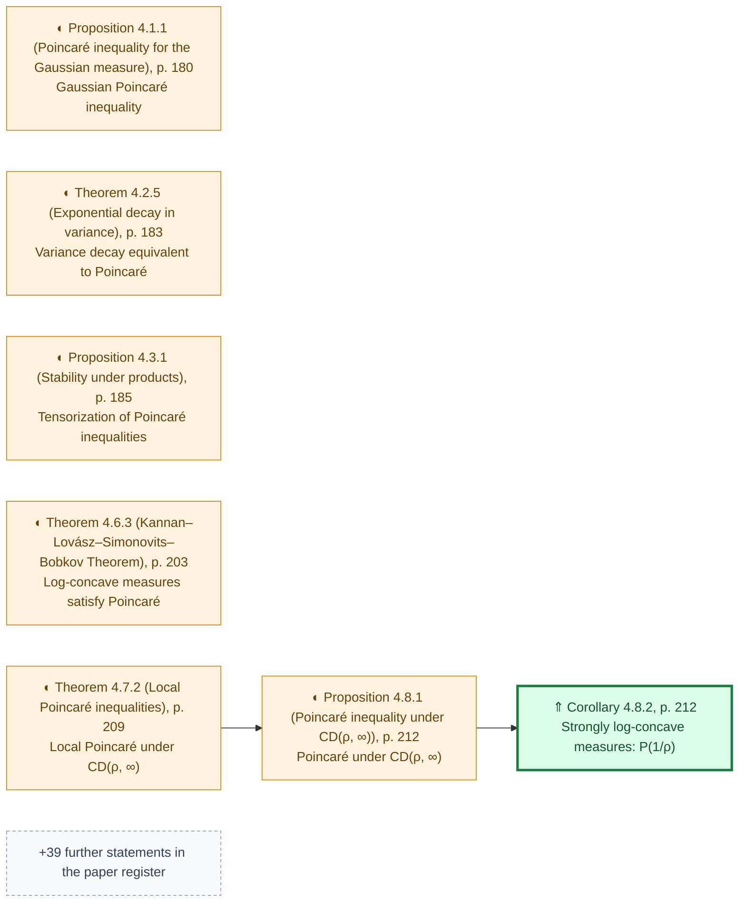
```mermaid
flowchart LR
    BGL2014_P411["◐ Proposition 4.1.1 (Poincaré inequality for the Gaussian measure), p. 180<br/>Gaussian Poincaré inequality"]
    BGL2014_T425["◐ Theorem 4.2.5 (Exponential decay in variance), p. 183<br/>Variance decay equivalent to Poincaré"]
    BGL2014_P431["◐ Proposition 4.3.1 (Stability under products), p. 185<br/>Tensorization of Poincaré inequalities"]
    BGL2014_T463["◐ Theorem 4.6.3 (Kannan–Lovász–Simonovits–Bobkov Theorem), p. 203<br/>Log-concave measures satisfy Poincaré"]
    BGL2014_T472["◐ Theorem 4.7.2 (Local Poincaré inequalities), p. 209<br/>Local Poincaré under CD(ρ, ∞)"]
    BGL2014_P481["◐ Proposition 4.8.1 (Poincaré inequality under CD(ρ, ∞)), p. 212<br/>Poincaré under CD(ρ, ∞)"]
    BGL2014_C482["⇑ Corollary 4.8.2, p. 212<br/>Strongly log-concave measures: P(1/ρ)"]
    BGL2014_T472 --> BGL2014_P481
    BGL2014_P481 --> BGL2014_C482
    BGL2014_more["+39 further statements in the paper register"]
    classDef lemma_partial fill:#fff3df,stroke:#c88719,color:#66420d;
    class BGL2014_P411,BGL2014_T425,BGL2014_P431,BGL2014_T463,BGL2014_T472,BGL2014_P481 lemma_partial;
    classDef lemma_improved fill:#dcfce7,stroke:#15803d,color:#14532d;
    class BGL2014_C482 lemma_improved;
    style BGL2014_C482 stroke-width:3px
    classDef lemma_more fill:#f8fafc,stroke:#94a3b8,color:#334155,stroke-dasharray:4 3;
    class BGL2014_more lemma_more;
```

### Klartag (arXiv:1309.2767v1)

26 statements: 26 ○. [Full map](LITERATURE.md#klartag2014moment-lemma-map).


```mermaid
flowchart LR
    Klartag2014Moment_T11["○ Theorem 1.1<br/>Laplacian bound for moment map"]
    Klartag2014Moment_P21["○ Proposition 2.1<br/>Continuity of the moment measure"]
    Klartag2014Moment_L22["○ Lemma 2.2<br/>Linear growth of centered potentials"]
    Klartag2014Moment_L23["○ Lemma 2.3<br/>Two-sided linear bounds"]
    Klartag2014Moment_P31["○ Proposition 3.1<br/>Hessian of psi is bounded"]
    Klartag2014Moment_L32["○ Lemma 3.2 (Berman and Berndtsson)<br/>Legendre dual is bounded"]
    Klartag2014Moment_L33["○ Lemma 3.3<br/>Gradient approaches support function gradient"]
    Klartag2014Moment_C34["○ Corollary 3.4<br/>Second difference attains supremum"]
    Klartag2014Moment_P41["○ Proposition 4.1<br/>Stochastic completeness criterion"]
    Klartag2014Moment_R42["○ Remark 4.2<br/>Log-concave case is stochastically complete"]
    Klartag2014Moment_L43["○ Lemma 4.3<br/>Laplacian in moment coordinates"]
    Klartag2014Moment_L44["○ Lemma 4.4<br/>L psi bounded above"]
    Klartag2014Moment_P45["○ Proposition 4.5<br/>Global non-exploding diffusion"]
    Klartag2014Moment_L52["○ Lemma 5.2<br/>Power of phi^{11} supersolution"]
    Klartag2014Moment_L53["○ Lemma 5.3<br/>Mean and second moment"]
    Klartag2014Moment_L55["○ Lemma 5.5<br/>Reverse bound along diffusion"]
    Klartag2014Moment_C57["○ Corollary 5.7<br/>Inverse Hessian bounded by covariance"]
    Klartag2014Moment_C57 --> Klartag2014Moment_T11
    Klartag2014Moment_P21 --> Klartag2014Moment_T11
    Klartag2014Moment_L22 --> Klartag2014Moment_P21
    Klartag2014Moment_L23 --> Klartag2014Moment_P21
    Klartag2014Moment_L22 --> Klartag2014Moment_L23
    Klartag2014Moment_L32 --> Klartag2014Moment_P31
    Klartag2014Moment_L33 --> Klartag2014Moment_P31
    Klartag2014Moment_C34 --> Klartag2014Moment_P31
    Klartag2014Moment_L32 --> Klartag2014Moment_L33
    Klartag2014Moment_L33 --> Klartag2014Moment_C34
    Klartag2014Moment_P45 --> Klartag2014Moment_P41
    Klartag2014Moment_P41 --> Klartag2014Moment_R42
    Klartag2014Moment_L43 --> Klartag2014Moment_L44
    Klartag2014Moment_L44 --> Klartag2014Moment_P45
    Klartag2014Moment_P45 --> Klartag2014Moment_L53
    Klartag2014Moment_R42 --> Klartag2014Moment_L53
    Klartag2014Moment_P31 --> Klartag2014Moment_L55
    Klartag2014Moment_L52 --> Klartag2014Moment_L55
    Klartag2014Moment_L53 --> Klartag2014Moment_L55
    Klartag2014Moment_L53 --> Klartag2014Moment_C57
    Klartag2014Moment_L55 --> Klartag2014Moment_C57
    Klartag2014Moment_more["+9 further statements in the paper register"]
    classDef lemma_pending fill:#fee2e2,stroke:#dc2626,color:#991b1b;
    class Klartag2014Moment_T11,Klartag2014Moment_P21,Klartag2014Moment_L22,Klartag2014Moment_L23,Klartag2014Moment_P31,Klartag2014Moment_L32,Klartag2014Moment_L33,Klartag2014Moment_C34,Klartag2014Moment_P41,Klartag2014Moment_R42,Klartag2014Moment_L43,Klartag2014Moment_L44,Klartag2014Moment_P45,Klartag2014Moment_L52,Klartag2014Moment_L53,Klartag2014Moment_L55,Klartag2014Moment_C57 lemma_pending;
    style Klartag2014Moment_T11 stroke-width:3px
    classDef lemma_more fill:#f8fafc,stroke:#94a3b8,color:#334155,stroke-dasharray:4 3;
    class Klartag2014Moment_more lemma_more;
```

### Cordero-Erausquin–Klartag (arXiv:1304.0630v1)

18 statements: 1 ◐, 15 ○, 2 ⇑. [Full map](LITERATURE.md#corderoklartag2015-lemma-map).

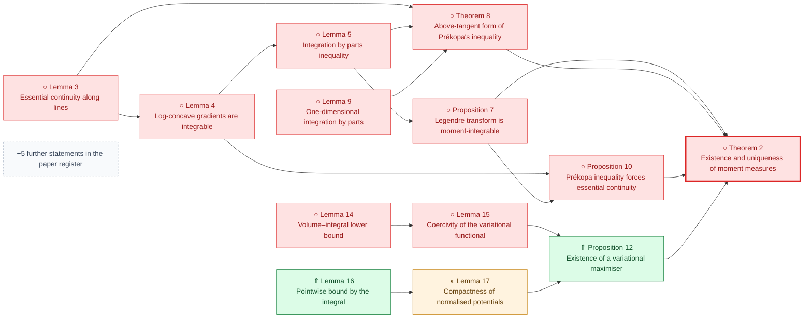
```mermaid
flowchart LR
    CorderoKlartag2015_T2["○ Theorem 2<br/>Existence and uniqueness of moment measures"]
    CorderoKlartag2015_L3["○ Lemma 3<br/>Essential continuity along lines"]
    CorderoKlartag2015_L4["○ Lemma 4<br/>Log-concave gradients are integrable"]
    CorderoKlartag2015_L5["○ Lemma 5<br/>Integration by parts inequality"]
    CorderoKlartag2015_P7["○ Proposition 7<br/>Legendre transform is moment-integrable"]
    CorderoKlartag2015_T8["○ Theorem 8<br/>Above-tangent form of Prékopa's inequality"]
    CorderoKlartag2015_L9["○ Lemma 9<br/>One-dimensional integration by parts"]
    CorderoKlartag2015_P10["○ Proposition 10<br/>Prékopa inequality forces essential continuity"]
    CorderoKlartag2015_P12["⇑ Proposition 12<br/>Existence of a variational maximiser"]
    CorderoKlartag2015_L14["○ Lemma 14<br/>Volume–integral lower bound"]
    CorderoKlartag2015_L15["○ Lemma 15<br/>Coercivity of the variational functional"]
    CorderoKlartag2015_L16["⇑ Lemma 16<br/>Pointwise bound by the integral"]
    CorderoKlartag2015_L17["◐ Lemma 17<br/>Compactness of normalised potentials"]
    CorderoKlartag2015_P7 --> CorderoKlartag2015_T2
    CorderoKlartag2015_T8 --> CorderoKlartag2015_T2
    CorderoKlartag2015_P10 --> CorderoKlartag2015_T2
    CorderoKlartag2015_P12 --> CorderoKlartag2015_T2
    CorderoKlartag2015_L3 --> CorderoKlartag2015_L4
    CorderoKlartag2015_L4 --> CorderoKlartag2015_L5
    CorderoKlartag2015_L5 --> CorderoKlartag2015_P7
    CorderoKlartag2015_L3 --> CorderoKlartag2015_T8
    CorderoKlartag2015_L5 --> CorderoKlartag2015_T8
    CorderoKlartag2015_L9 --> CorderoKlartag2015_T8
    CorderoKlartag2015_L4 --> CorderoKlartag2015_P10
    CorderoKlartag2015_P7 --> CorderoKlartag2015_P10
    CorderoKlartag2015_L15 --> CorderoKlartag2015_P12
    CorderoKlartag2015_L17 --> CorderoKlartag2015_P12
    CorderoKlartag2015_L14 --> CorderoKlartag2015_L15
    CorderoKlartag2015_L16 --> CorderoKlartag2015_L17
    CorderoKlartag2015_more["+5 further statements in the paper register"]
    classDef lemma_partial fill:#fff3df,stroke:#c88719,color:#66420d;
    class CorderoKlartag2015_L17 lemma_partial;
    classDef lemma_pending fill:#fee2e2,stroke:#dc2626,color:#991b1b;
    class CorderoKlartag2015_T2,CorderoKlartag2015_L3,CorderoKlartag2015_L4,CorderoKlartag2015_L5,CorderoKlartag2015_P7,CorderoKlartag2015_T8,CorderoKlartag2015_L9,CorderoKlartag2015_P10,CorderoKlartag2015_L14,CorderoKlartag2015_L15 lemma_pending;
    classDef lemma_improved fill:#dcfce7,stroke:#15803d,color:#14532d;
    class CorderoKlartag2015_P12,CorderoKlartag2015_L16 lemma_improved;
    style CorderoKlartag2015_T2 stroke-width:3px
    classDef lemma_more fill:#f8fafc,stroke:#94a3b8,color:#334155,stroke-dasharray:4 3;
    class CorderoKlartag2015_more lemma_more;
```

### Ambrosio–Di Marino–Gigli (arXiv:1603.08412v1)

11 statements: 6 ✓, 1 ◐, 4 ○. [Full map](LITERATURE.md#admg2017-lemma-map).

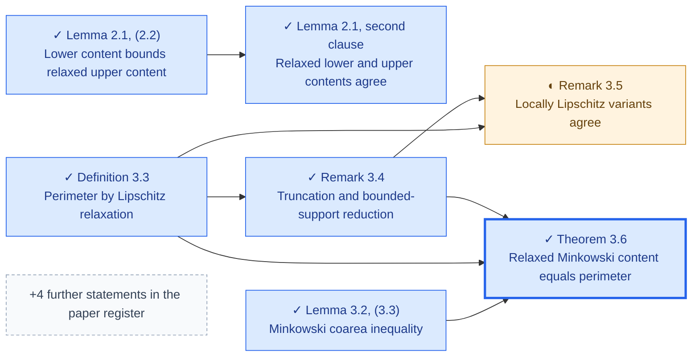
```mermaid
flowchart LR
    ADMG2017_L21a["✓ Lemma 2.1, (2.2)<br/>Lower content bounds relaxed upper content"]
    ADMG2017_L21b["✓ Lemma 2.1, second clause<br/>Relaxed lower and upper contents agree"]
    ADMG2017_L32["✓ Lemma 3.2, (3.3)<br/>Minkowski coarea inequality"]
    ADMG2017_D33["✓ Definition 3.3<br/>Perimeter by Lipschitz relaxation"]
    ADMG2017_R34["✓ Remark 3.4<br/>Truncation and bounded-support reduction"]
    ADMG2017_R35["◐ Remark 3.5<br/>Locally Lipschitz variants agree"]
    ADMG2017_T36["✓ Theorem 3.6<br/>Relaxed Minkowski content equals perimeter"]
    ADMG2017_L21a --> ADMG2017_L21b
    ADMG2017_D33 --> ADMG2017_R34
    ADMG2017_D33 --> ADMG2017_R35
    ADMG2017_R34 --> ADMG2017_R35
    ADMG2017_L32 --> ADMG2017_T36
    ADMG2017_D33 --> ADMG2017_T36
    ADMG2017_R34 --> ADMG2017_T36
    ADMG2017_more["+4 further statements in the paper register"]
    classDef lemma_formalized fill:#dbeafe,stroke:#2563eb,color:#1e3a8a;
    class ADMG2017_L21a,ADMG2017_L21b,ADMG2017_L32,ADMG2017_D33,ADMG2017_R34,ADMG2017_T36 lemma_formalized;
    classDef lemma_partial fill:#fff3df,stroke:#c88719,color:#66420d;
    class ADMG2017_R35 lemma_partial;
    style ADMG2017_T36 stroke-width:3px
    classDef lemma_more fill:#f8fafc,stroke:#94a3b8,color:#334155,stroke-dasharray:4 3;
    class ADMG2017_more lemma_more;
```

### Lee–Vempala (arXiv:1612.01507v3)

59 statements: 1 ✓, 2 ◐, 55 ○, 1 ⇑. [Full map](LITERATURE.md#leevempala2024-lemma-map).

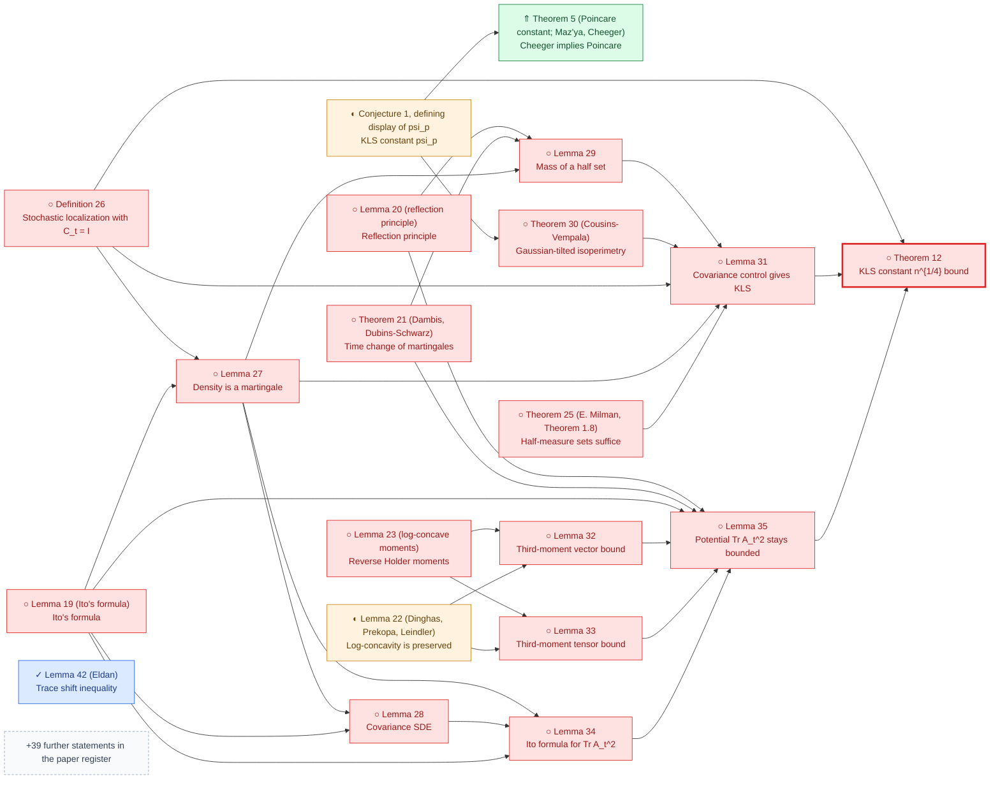
```mermaid
flowchart LR
    LeeVempala2024_Dpsi["◐ Conjecture 1, defining display of psi_p<br/>KLS constant psi_p"]
    LeeVempala2024_T5["⇑ Theorem 5 (Poincare constant; Maz'ya, Cheeger)<br/>Cheeger implies Poincare"]
    LeeVempala2024_T12["○ Theorem 12<br/>KLS constant n^{1/4} bound"]
    LeeVempala2024_L19["○ Lemma 19 (Ito's formula)<br/>Ito's formula"]
    LeeVempala2024_L20["○ Lemma 20 (reflection principle)<br/>Reflection principle"]
    LeeVempala2024_T21["○ Theorem 21 (Dambis, Dubins-Schwarz)<br/>Time change of martingales"]
    LeeVempala2024_L22["◐ Lemma 22 (Dinghas, Prekopa, Leindler)<br/>Log-concavity is preserved"]
    LeeVempala2024_L23["○ Lemma 23 (log-concave moments)<br/>Reverse Holder moments"]
    LeeVempala2024_T25["○ Theorem 25 (E. Milman, Theorem 1.8)<br/>Half-measure sets suffice"]
    LeeVempala2024_D26["○ Definition 26<br/>Stochastic localization with C_t = I"]
    LeeVempala2024_L27["○ Lemma 27<br/>Density is a martingale"]
    LeeVempala2024_L28["○ Lemma 28<br/>Covariance SDE"]
    LeeVempala2024_L29["○ Lemma 29<br/>Mass of a half set"]
    LeeVempala2024_T30["○ Theorem 30 (Cousins-Vempala)<br/>Gaussian-tilted isoperimetry"]
    LeeVempala2024_L31["○ Lemma 31<br/>Covariance control gives KLS"]
    LeeVempala2024_L32["○ Lemma 32<br/>Third-moment vector bound"]
    LeeVempala2024_L33["○ Lemma 33<br/>Third-moment tensor bound"]
    LeeVempala2024_L34["○ Lemma 34<br/>Ito formula for Tr A_t^2"]
    LeeVempala2024_L35["○ Lemma 35<br/>Potential Tr A_t^2 stays bounded"]
    LeeVempala2024_L42["✓ Lemma 42 (Eldan)<br/>Trace shift inequality"]
    LeeVempala2024_Dpsi --> LeeVempala2024_T5
    LeeVempala2024_L35 --> LeeVempala2024_T12
    LeeVempala2024_L31 --> LeeVempala2024_T12
    LeeVempala2024_D26 --> LeeVempala2024_T12
    LeeVempala2024_L19 --> LeeVempala2024_L27
    LeeVempala2024_D26 --> LeeVempala2024_L27
    LeeVempala2024_L19 --> LeeVempala2024_L28
    LeeVempala2024_L27 --> LeeVempala2024_L28
    LeeVempala2024_L27 --> LeeVempala2024_L29
    LeeVempala2024_T21 --> LeeVempala2024_L29
    LeeVempala2024_L20 --> LeeVempala2024_L29
    LeeVempala2024_Dpsi --> LeeVempala2024_T30
    LeeVempala2024_T25 --> LeeVempala2024_L31
    LeeVempala2024_L27 --> LeeVempala2024_L31
    LeeVempala2024_D26 --> LeeVempala2024_L31
    LeeVempala2024_T30 --> LeeVempala2024_L31
    LeeVempala2024_L29 --> LeeVempala2024_L31
    LeeVempala2024_L22 --> LeeVempala2024_L32
    LeeVempala2024_L23 --> LeeVempala2024_L32
    LeeVempala2024_L22 --> LeeVempala2024_L33
    LeeVempala2024_L23 --> LeeVempala2024_L33
    LeeVempala2024_L19 --> LeeVempala2024_L34
    LeeVempala2024_L28 --> LeeVempala2024_L34
    LeeVempala2024_L27 --> LeeVempala2024_L34
    LeeVempala2024_L34 --> LeeVempala2024_L35
    LeeVempala2024_L33 --> LeeVempala2024_L35
    LeeVempala2024_L32 --> LeeVempala2024_L35
    LeeVempala2024_L19 --> LeeVempala2024_L35
    LeeVempala2024_T21 --> LeeVempala2024_L35
    LeeVempala2024_L20 --> LeeVempala2024_L35
    LeeVempala2024_more["+39 further statements in the paper register"]
    classDef lemma_formalized fill:#dbeafe,stroke:#2563eb,color:#1e3a8a;
    class LeeVempala2024_L42 lemma_formalized;
    classDef lemma_partial fill:#fff3df,stroke:#c88719,color:#66420d;
    class LeeVempala2024_Dpsi,LeeVempala2024_L22 lemma_partial;
    classDef lemma_pending fill:#fee2e2,stroke:#dc2626,color:#991b1b;
    class LeeVempala2024_T12,LeeVempala2024_L19,LeeVempala2024_L20,LeeVempala2024_T21,LeeVempala2024_L23,LeeVempala2024_T25,LeeVempala2024_D26,LeeVempala2024_L27,LeeVempala2024_L28,LeeVempala2024_L29,LeeVempala2024_T30,LeeVempala2024_L31,LeeVempala2024_L32,LeeVempala2024_L33,LeeVempala2024_L34,LeeVempala2024_L35 lemma_pending;
    classDef lemma_improved fill:#dcfce7,stroke:#15803d,color:#14532d;
    class LeeVempala2024_T5 lemma_improved;
    style LeeVempala2024_T12 stroke-width:3px
    classDef lemma_more fill:#f8fafc,stroke:#94a3b8,color:#334155,stroke-dasharray:4 3;
    class LeeVempala2024_more lemma_more;
```

### Fathi (arXiv:1804.04699v3)

10 statements: 10 ○. [Full map](LITERATURE.md#fathi2019-lemma-map).

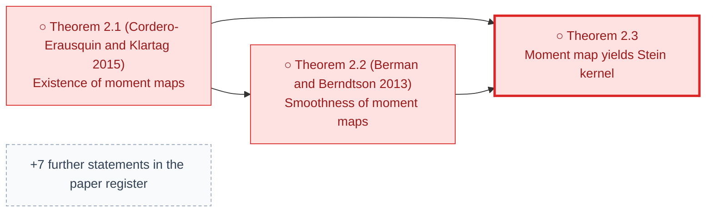
```mermaid
flowchart LR
    Fathi2019_T21["○ Theorem 2.1 (Cordero-Erausquin and Klartag 2015)<br/>Existence of moment maps"]
    Fathi2019_T22["○ Theorem 2.2 (Berman and Berndtson 2013)<br/>Smoothness of moment maps"]
    Fathi2019_T23["○ Theorem 2.3<br/>Moment map yields Stein kernel"]
    Fathi2019_T21 --> Fathi2019_T22
    Fathi2019_T21 --> Fathi2019_T23
    Fathi2019_T22 --> Fathi2019_T23
    Fathi2019_more["+7 further statements in the paper register"]
    classDef lemma_pending fill:#fee2e2,stroke:#dc2626,color:#991b1b;
    class Fathi2019_T21,Fathi2019_T22,Fathi2019_T23 lemma_pending;
    style Fathi2019_T23 stroke-width:3px
    classDef lemma_more fill:#f8fafc,stroke:#94a3b8,color:#334155,stroke-dasharray:4 3;
    class Fathi2019_more lemma_more;
```

### Chen (arXiv:2011.13661v2)

19 statements: 2 ◐, 17 ○. [Full map](LITERATURE.md#chen2021-lemma-map).


```mermaid
flowchart LR
    Chen2021_D2["◐ Equation (2)<br/>Isoperimetric coefficient ψ(p)"]
    Chen2021_T1["○ Theorem 1<br/>Almost constant KLS lower bound"]
    Chen2021_L1["○ Lemma 1<br/>Main bound for compact support"]
    Chen2021_L2["○ Lemma 2<br/>One bootstrap step"]
    Chen2021_L3["○ Lemma 3<br/>Localization SDE well-posed"]
    Chen2021_L4["○ Lemma 4 (Lee–Vempala, Lemma 29)<br/>Half-mass set stays balanced"]
    Chen2021_L5["○ Lemma 5<br/>Spectral norm control"]
    Chen2021_L6["○ Lemma 6<br/>Potential drift and diffusion bounds"]
    Chen2021_L7["○ Lemma 7<br/>Potential stays small up to T₁"]
    Chen2021_L8["○ Lemma 8<br/>Polynomial growth of E Γ^{1/q}"]
    Chen2021_L9["○ Lemma 9<br/>Vector third-moment bound"]
    Chen2021_L10["○ Lemma 10<br/>Tensor bound from the hypothesis"]
    Chen2021_L11["○ Lemma 11<br/>Tensor bound under a Gaussian factor"]
    Chen2021_L12["○ Lemma 12 (Lee–Vempala, arXiv v2 Lemma 43)<br/>Tensor exponent swap"]
    Chen2021_L13a["○ Lemma 13, part 1 (Lee–Vempala, arXiv v2 Lemma 41; Eldan Lemma 6)<br/>Δ-trace bound for projections"]
    Chen2021_L13b["○ Lemma 13, part 2<br/>Δ-trace bound for PSD weights"]
    Chen2021_CH["◐ Proof of Lemma 13, step (ii) (Maz'ya; Cheeger; Milman Theorem 1.1)<br/>Cheeger's inequality"]
    Chen2021_L1 --> Chen2021_T1
    Chen2021_L2 --> Chen2021_L1
    Chen2021_L3 --> Chen2021_L2
    Chen2021_L4 --> Chen2021_L2
    Chen2021_L5 --> Chen2021_L2
    Chen2021_L3 --> Chen2021_L4
    Chen2021_L7 --> Chen2021_L5
    Chen2021_L8 --> Chen2021_L5
    Chen2021_L9 --> Chen2021_L6
    Chen2021_L10 --> Chen2021_L6
    Chen2021_L11 --> Chen2021_L6
    Chen2021_L12 --> Chen2021_L6
    Chen2021_L6 --> Chen2021_L7
    Chen2021_L6 --> Chen2021_L8
    Chen2021_L12 --> Chen2021_L10
    Chen2021_L13b --> Chen2021_L10
    Chen2021_L12 --> Chen2021_L11
    Chen2021_CH --> Chen2021_L13a
    Chen2021_L13a --> Chen2021_L13b
    Chen2021_more["+2 further statements in the paper register"]
    classDef lemma_partial fill:#fff3df,stroke:#c88719,color:#66420d;
    class Chen2021_D2,Chen2021_CH lemma_partial;
    classDef lemma_pending fill:#fee2e2,stroke:#dc2626,color:#991b1b;
    class Chen2021_T1,Chen2021_L1,Chen2021_L2,Chen2021_L3,Chen2021_L4,Chen2021_L5,Chen2021_L6,Chen2021_L7,Chen2021_L8,Chen2021_L9,Chen2021_L10,Chen2021_L11,Chen2021_L12,Chen2021_L13a,Chen2021_L13b lemma_pending;
    style Chen2021_T1 stroke-width:3px
    classDef lemma_more fill:#f8fafc,stroke:#94a3b8,color:#334155,stroke-dasharray:4 3;
    class Chen2021_more lemma_more;
```

### De Ponti–Mondino (arXiv:1902.03835v2)

12 statements: 2 ✓, 5 ◐, 5 ○. [Full map](LITERATURE.md#depontimondino2021-lemma-map).

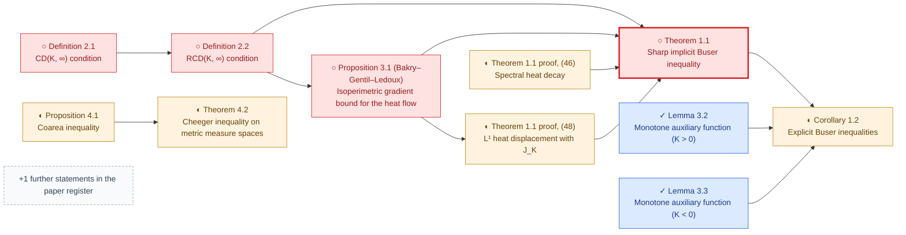
```mermaid
flowchart LR
    DePontiMondino2021_T11["○ Theorem 1.1<br/>Sharp implicit Buser inequality"]
    DePontiMondino2021_C12["◐ Corollary 1.2<br/>Explicit Buser inequalities"]
    DePontiMondino2021_D21["○ Definition 2.1<br/>CD(K, ∞) condition"]
    DePontiMondino2021_D22["○ Definition 2.2<br/>RCD(K, ∞) condition"]
    DePontiMondino2021_P31["○ Proposition 3.1 (Bakry–Gentil–Ledoux)<br/>Isoperimetric gradient bound for the heat flow"]
    DePontiMondino2021_E46["◐ Theorem 1.1 proof, (46)<br/>Spectral heat decay"]
    DePontiMondino2021_E48["◐ Theorem 1.1 proof, (48)<br/>L¹ heat displacement with J_K"]
    DePontiMondino2021_L32["✓ Lemma 3.2<br/>Monotone auxiliary function (K > 0)"]
    DePontiMondino2021_L33["✓ Lemma 3.3<br/>Monotone auxiliary function (K < 0)"]
    DePontiMondino2021_P41["◐ Proposition 4.1<br/>Coarea inequality"]
    DePontiMondino2021_T42["◐ Theorem 4.2<br/>Cheeger inequality on metric measure spaces"]
    DePontiMondino2021_D22 --> DePontiMondino2021_T11
    DePontiMondino2021_P31 --> DePontiMondino2021_T11
    DePontiMondino2021_E46 --> DePontiMondino2021_T11
    DePontiMondino2021_E48 --> DePontiMondino2021_T11
    DePontiMondino2021_T11 --> DePontiMondino2021_C12
    DePontiMondino2021_L32 --> DePontiMondino2021_C12
    DePontiMondino2021_L33 --> DePontiMondino2021_C12
    DePontiMondino2021_D21 --> DePontiMondino2021_D22
    DePontiMondino2021_D22 --> DePontiMondino2021_P31
    DePontiMondino2021_P31 --> DePontiMondino2021_E48
    DePontiMondino2021_P41 --> DePontiMondino2021_T42
    DePontiMondino2021_more["+1 further statements in the paper register"]
    classDef lemma_formalized fill:#dbeafe,stroke:#2563eb,color:#1e3a8a;
    class DePontiMondino2021_L32,DePontiMondino2021_L33 lemma_formalized;
    classDef lemma_partial fill:#fff3df,stroke:#c88719,color:#66420d;
    class DePontiMondino2021_C12,DePontiMondino2021_E46,DePontiMondino2021_E48,DePontiMondino2021_P41,DePontiMondino2021_T42 lemma_partial;
    classDef lemma_pending fill:#fee2e2,stroke:#dc2626,color:#991b1b;
    class DePontiMondino2021_T11,DePontiMondino2021_D21,DePontiMondino2021_D22,DePontiMondino2021_P31 lemma_pending;
    style DePontiMondino2021_T11 stroke-width:3px
    classDef lemma_more fill:#f8fafc,stroke:#94a3b8,color:#334155,stroke-dasharray:4 3;
    class DePontiMondino2021_more lemma_more;
```

### Klartag–Lehec (arXiv:2203.15551v2)

28 statements: 1 ✓, 7 ◐, 20 ○. [Full map](LITERATURE.md#klartaglehec2022-lemma-map).

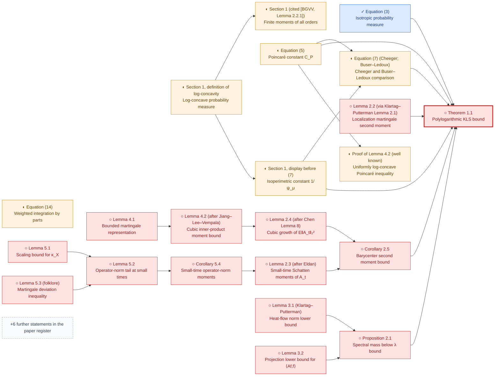
```mermaid
flowchart LR
    KlartagLehec2022_DLC["◐ Section 1, definition of log-concavity<br/>Log-concave probability measure"]
    KlartagLehec2022_MOM["◐ Section 1 (cited [BGVV, Lemma 2.2.1])<br/>Finite moments of all orders"]
    KlartagLehec2022_D3["✓ Equation (3)<br/>Isotropic probability measure"]
    KlartagLehec2022_D5["◐ Equation (5)<br/>Poincaré constant C_P"]
    KlartagLehec2022_DPSI["◐ Section 1, display before (7)<br/>Isoperimetric constant 1/ψ_μ"]
    KlartagLehec2022_E7["◐ Equation (7) (Cheeger; Buser–Ledoux)<br/>Cheeger and Buser–Ledoux comparison"]
    KlartagLehec2022_T11["○ Theorem 1.1<br/>Polylogarithmic KLS bound"]
    KlartagLehec2022_E14["◐ Equation (14)<br/>Weighted integration by parts"]
    KlartagLehec2022_P21["○ Proposition 2.1<br/>Spectral mass below λ bound"]
    KlartagLehec2022_L22["○ Lemma 2.2 (via Klartag–Putterman Lemma 2.1)<br/>Localization martingale second moment"]
    KlartagLehec2022_L23["○ Lemma 2.3 (after Eldan)<br/>Small-time Schatten moments of A_t"]
    KlartagLehec2022_L24["○ Lemma 2.4 (after Chen Lemma 8)<br/>Cubic growth of E‖A_t‖₂²"]
    KlartagLehec2022_C25["○ Corollary 2.5<br/>Barycenter second moment bound"]
    KlartagLehec2022_L31["○ Lemma 3.1 (Klartag–Putterman)<br/>Heat-flow norm lower bound"]
    KlartagLehec2022_L32["○ Lemma 3.2<br/>Projection lower bound for ⟨Af,f⟩"]
    KlartagLehec2022_L41["○ Lemma 4.1<br/>Bounded martingale representation"]
    KlartagLehec2022_UP["◐ Proof of Lemma 4.2 (well known)<br/>Uniformly log-concave Poincaré inequality"]
    KlartagLehec2022_L42["○ Lemma 4.2 (after Jiang–Lee–Vempala)<br/>Cubic inner-product moment bound"]
    KlartagLehec2022_L51["○ Lemma 5.1<br/>Scaling bound for κ_X"]
    KlartagLehec2022_L52["○ Lemma 5.2<br/>Operator-norm tail at small times"]
    KlartagLehec2022_L53["○ Lemma 5.3 (folklore)<br/>Martingale deviation inequality"]
    KlartagLehec2022_C54["○ Corollary 5.4<br/>Small-time operator-norm moments"]
    KlartagLehec2022_DLC --> KlartagLehec2022_MOM
    KlartagLehec2022_DLC --> KlartagLehec2022_DPSI
    KlartagLehec2022_D5 --> KlartagLehec2022_E7
    KlartagLehec2022_DPSI --> KlartagLehec2022_E7
    KlartagLehec2022_P21 --> KlartagLehec2022_T11
    KlartagLehec2022_L22 --> KlartagLehec2022_T11
    KlartagLehec2022_C25 --> KlartagLehec2022_T11
    KlartagLehec2022_E7 --> KlartagLehec2022_T11
    KlartagLehec2022_D3 --> KlartagLehec2022_T11
    KlartagLehec2022_D5 --> KlartagLehec2022_T11
    KlartagLehec2022_DPSI --> KlartagLehec2022_T11
    KlartagLehec2022_L31 --> KlartagLehec2022_P21
    KlartagLehec2022_L32 --> KlartagLehec2022_P21
    KlartagLehec2022_C54 --> KlartagLehec2022_L23
    KlartagLehec2022_L42 --> KlartagLehec2022_L24
    KlartagLehec2022_L23 --> KlartagLehec2022_C25
    KlartagLehec2022_L24 --> KlartagLehec2022_C25
    KlartagLehec2022_D5 --> KlartagLehec2022_UP
    KlartagLehec2022_L41 --> KlartagLehec2022_L42
    KlartagLehec2022_L51 --> KlartagLehec2022_L52
    KlartagLehec2022_L53 --> KlartagLehec2022_L52
    KlartagLehec2022_L52 --> KlartagLehec2022_C54
    KlartagLehec2022_more["+6 further statements in the paper register"]
    classDef lemma_formalized fill:#dbeafe,stroke:#2563eb,color:#1e3a8a;
    class KlartagLehec2022_D3 lemma_formalized;
    classDef lemma_partial fill:#fff3df,stroke:#c88719,color:#66420d;
    class KlartagLehec2022_DLC,KlartagLehec2022_MOM,KlartagLehec2022_D5,KlartagLehec2022_DPSI,KlartagLehec2022_E7,KlartagLehec2022_E14,KlartagLehec2022_UP lemma_partial;
    classDef lemma_pending fill:#fee2e2,stroke:#dc2626,color:#991b1b;
    class KlartagLehec2022_T11,KlartagLehec2022_P21,KlartagLehec2022_L22,KlartagLehec2022_L23,KlartagLehec2022_L24,KlartagLehec2022_C25,KlartagLehec2022_L31,KlartagLehec2022_L32,KlartagLehec2022_L41,KlartagLehec2022_L42,KlartagLehec2022_L51,KlartagLehec2022_L52,KlartagLehec2022_L53,KlartagLehec2022_C54 lemma_pending;
    style KlartagLehec2022_T11 stroke-width:3px
    classDef lemma_more fill:#f8fafc,stroke:#94a3b8,color:#334155,stroke-dasharray:4 3;
    class KlartagLehec2022_more lemma_more;
```

### Jambulapati–Lee–Vempala (arXiv:2208.11644v2)

27 statements: 1 ◐, 26 ○. [Full map](LITERATURE.md#jambulapatileevempala2022-lemma-map).

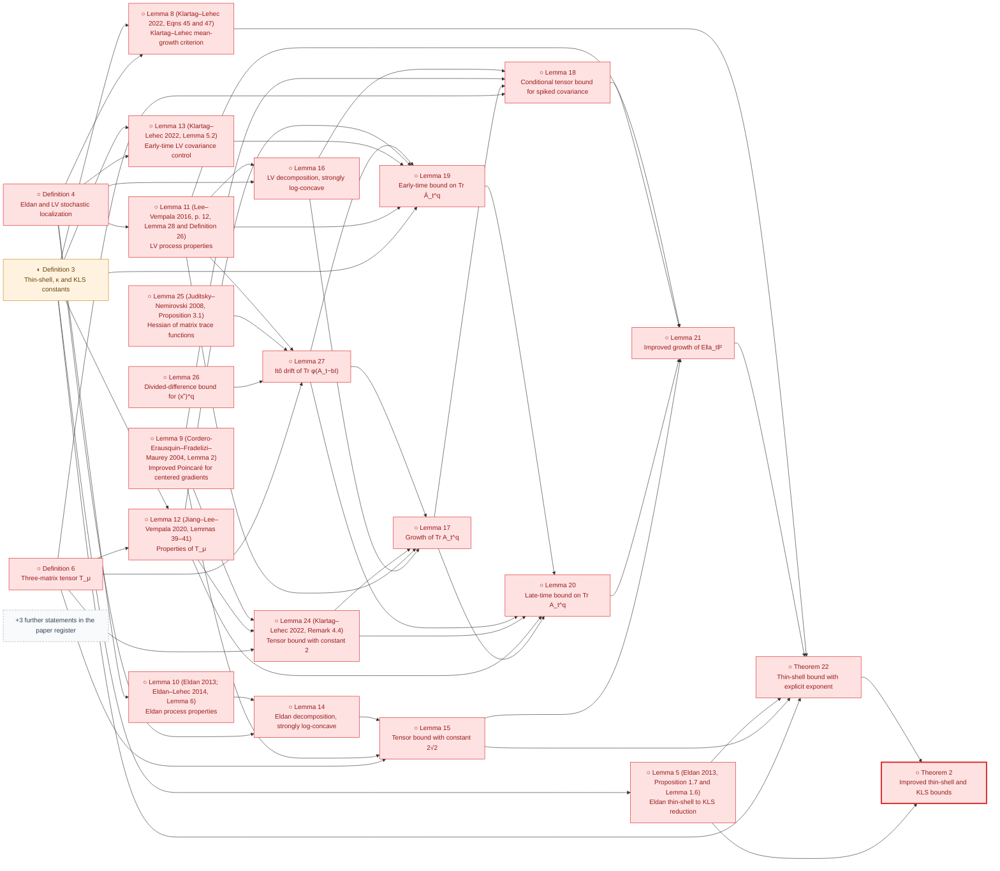
```mermaid
flowchart LR
    JambulapatiLeeVempala2022_T2["○ Theorem 2<br/>Improved thin-shell and KLS bounds"]
    JambulapatiLeeVempala2022_D3["◐ Definition 3<br/>Thin-shell, κ and KLS constants"]
    JambulapatiLeeVempala2022_D4["○ Definition 4<br/>Eldan and LV stochastic localization"]
    JambulapatiLeeVempala2022_L5["○ Lemma 5 (Eldan 2013, Proposition 1.7 and Lemma 1.6)<br/>Eldan thin-shell to KLS reduction"]
    JambulapatiLeeVempala2022_D6["○ Definition 6<br/>Three-matrix tensor T_μ"]
    JambulapatiLeeVempala2022_L8["○ Lemma 8 (Klartag–Lehec 2022, Eqns 45 and 47)<br/>Klartag–Lehec mean-growth criterion"]
    JambulapatiLeeVempala2022_L9["○ Lemma 9 (Cordero-Erausquin–Fradelizi–Maurey 2004, Lemma 2)<br/>Improved Poincaré for centered gradients"]
    JambulapatiLeeVempala2022_L10["○ Lemma 10 (Eldan 2013; Eldan–Lehec 2014, Lemma 6)<br/>Eldan process properties"]
    JambulapatiLeeVempala2022_L11["○ Lemma 11 (Lee–Vempala 2016, p. 12, Lemma 28 and Definition 26)<br/>LV process properties"]
    JambulapatiLeeVempala2022_L12["○ Lemma 12 (Jiang–Lee–Vempala 2020, Lemmas 39–41)<br/>Properties of T_μ"]
    JambulapatiLeeVempala2022_L13["○ Lemma 13 (Klartag–Lehec 2022, Lemma 5.2)<br/>Early-time LV covariance control"]
    JambulapatiLeeVempala2022_L14["○ Lemma 14<br/>Eldan decomposition, strongly log-concave"]
    JambulapatiLeeVempala2022_L15["○ Lemma 15<br/>Tensor bound with constant 2√2"]
    JambulapatiLeeVempala2022_L16["○ Lemma 16<br/>LV decomposition, strongly log-concave"]
    JambulapatiLeeVempala2022_L17["○ Lemma 17<br/>Growth of Tr A_t^q"]
    JambulapatiLeeVempala2022_L18["○ Lemma 18<br/>Conditional tensor bound for spiked covariance"]
    JambulapatiLeeVempala2022_L19["○ Lemma 19<br/>Early-time bound on Tr Ā_t^q"]
    JambulapatiLeeVempala2022_L20["○ Lemma 20<br/>Late-time bound on Tr A_t^q"]
    JambulapatiLeeVempala2022_L21["○ Lemma 21<br/>Improved growth of E‖a_t‖²"]
    JambulapatiLeeVempala2022_T22["○ Theorem 22<br/>Thin-shell bound with explicit exponent"]
    JambulapatiLeeVempala2022_L24["○ Lemma 24 (Klartag–Lehec 2022, Remark 4.4)<br/>Tensor bound with constant 2"]
    JambulapatiLeeVempala2022_L25["○ Lemma 25 (Juditsky–Nemirovski 2008, Proposition 3.1)<br/>Hessian of matrix trace functions"]
    JambulapatiLeeVempala2022_L26["○ Lemma 26<br/>Divided-difference bound for (x⁺)^q"]
    JambulapatiLeeVempala2022_L27["○ Lemma 27<br/>Itô drift of Tr φ(A_t−bI)"]
    JambulapatiLeeVempala2022_T22 --> JambulapatiLeeVempala2022_T2
    JambulapatiLeeVempala2022_L5 --> JambulapatiLeeVempala2022_T2
    JambulapatiLeeVempala2022_D3 --> JambulapatiLeeVempala2022_L5
    JambulapatiLeeVempala2022_D3 --> JambulapatiLeeVempala2022_L8
    JambulapatiLeeVempala2022_D4 --> JambulapatiLeeVempala2022_L8
    JambulapatiLeeVempala2022_D4 --> JambulapatiLeeVempala2022_L10
    JambulapatiLeeVempala2022_D4 --> JambulapatiLeeVempala2022_L11
    JambulapatiLeeVempala2022_D3 --> JambulapatiLeeVempala2022_L12
    JambulapatiLeeVempala2022_D6 --> JambulapatiLeeVempala2022_L12
    JambulapatiLeeVempala2022_D3 --> JambulapatiLeeVempala2022_L13
    JambulapatiLeeVempala2022_D4 --> JambulapatiLeeVempala2022_L13
    JambulapatiLeeVempala2022_L10 --> JambulapatiLeeVempala2022_L14
    JambulapatiLeeVempala2022_D4 --> JambulapatiLeeVempala2022_L14
    JambulapatiLeeVempala2022_L14 --> JambulapatiLeeVempala2022_L15
    JambulapatiLeeVempala2022_L9 --> JambulapatiLeeVempala2022_L15
    JambulapatiLeeVempala2022_D6 --> JambulapatiLeeVempala2022_L15
    JambulapatiLeeVempala2022_L11 --> JambulapatiLeeVempala2022_L16
    JambulapatiLeeVempala2022_D4 --> JambulapatiLeeVempala2022_L16
    JambulapatiLeeVempala2022_L27 --> JambulapatiLeeVempala2022_L17
    JambulapatiLeeVempala2022_L24 --> JambulapatiLeeVempala2022_L17
    JambulapatiLeeVempala2022_L11 --> JambulapatiLeeVempala2022_L17
    JambulapatiLeeVempala2022_L16 --> JambulapatiLeeVempala2022_L17
    JambulapatiLeeVempala2022_L16 --> JambulapatiLeeVempala2022_L18
    JambulapatiLeeVempala2022_L9 --> JambulapatiLeeVempala2022_L18
    JambulapatiLeeVempala2022_L17 --> JambulapatiLeeVempala2022_L18
    JambulapatiLeeVempala2022_D6 --> JambulapatiLeeVempala2022_L18
    JambulapatiLeeVempala2022_L27 --> JambulapatiLeeVempala2022_L19
    JambulapatiLeeVempala2022_L12 --> JambulapatiLeeVempala2022_L19
    JambulapatiLeeVempala2022_L13 --> JambulapatiLeeVempala2022_L19
    JambulapatiLeeVempala2022_L11 --> JambulapatiLeeVempala2022_L19
    JambulapatiLeeVempala2022_D3 --> JambulapatiLeeVempala2022_L19
    JambulapatiLeeVempala2022_L19 --> JambulapatiLeeVempala2022_L20
    JambulapatiLeeVempala2022_L27 --> JambulapatiLeeVempala2022_L20
    JambulapatiLeeVempala2022_L24 --> JambulapatiLeeVempala2022_L20
    JambulapatiLeeVempala2022_L12 --> JambulapatiLeeVempala2022_L20
    JambulapatiLeeVempala2022_L17 --> JambulapatiLeeVempala2022_L20
    JambulapatiLeeVempala2022_L11 --> JambulapatiLeeVempala2022_L21
    JambulapatiLeeVempala2022_L18 --> JambulapatiLeeVempala2022_L21
    JambulapatiLeeVempala2022_L20 --> JambulapatiLeeVempala2022_L21
    JambulapatiLeeVempala2022_L15 --> JambulapatiLeeVempala2022_L21
    JambulapatiLeeVempala2022_L8 --> JambulapatiLeeVempala2022_T22
    JambulapatiLeeVempala2022_L21 --> JambulapatiLeeVempala2022_T22
    JambulapatiLeeVempala2022_L5 --> JambulapatiLeeVempala2022_T22
    JambulapatiLeeVempala2022_L15 --> JambulapatiLeeVempala2022_T22
    JambulapatiLeeVempala2022_D3 --> JambulapatiLeeVempala2022_T22
    JambulapatiLeeVempala2022_L9 --> JambulapatiLeeVempala2022_L24
    JambulapatiLeeVempala2022_L12 --> JambulapatiLeeVempala2022_L24
    JambulapatiLeeVempala2022_D6 --> JambulapatiLeeVempala2022_L24
    JambulapatiLeeVempala2022_L11 --> JambulapatiLeeVempala2022_L27
    JambulapatiLeeVempala2022_L25 --> JambulapatiLeeVempala2022_L27
    JambulapatiLeeVempala2022_L26 --> JambulapatiLeeVempala2022_L27
    JambulapatiLeeVempala2022_D6 --> JambulapatiLeeVempala2022_L27
    JambulapatiLeeVempala2022_more["+3 further statements in the paper register"]
    classDef lemma_partial fill:#fff3df,stroke:#c88719,color:#66420d;
    class JambulapatiLeeVempala2022_D3 lemma_partial;
    classDef lemma_pending fill:#fee2e2,stroke:#dc2626,color:#991b1b;
    class JambulapatiLeeVempala2022_T2,JambulapatiLeeVempala2022_D4,JambulapatiLeeVempala2022_L5,JambulapatiLeeVempala2022_D6,JambulapatiLeeVempala2022_L8,JambulapatiLeeVempala2022_L9,JambulapatiLeeVempala2022_L10,JambulapatiLeeVempala2022_L11,JambulapatiLeeVempala2022_L12,JambulapatiLeeVempala2022_L13,JambulapatiLeeVempala2022_L14,JambulapatiLeeVempala2022_L15,JambulapatiLeeVempala2022_L16,JambulapatiLeeVempala2022_L17,JambulapatiLeeVempala2022_L18,JambulapatiLeeVempala2022_L19,JambulapatiLeeVempala2022_L20,JambulapatiLeeVempala2022_L21,JambulapatiLeeVempala2022_T22,JambulapatiLeeVempala2022_L24,JambulapatiLeeVempala2022_L25,JambulapatiLeeVempala2022_L26,JambulapatiLeeVempala2022_L27 lemma_pending;
    style JambulapatiLeeVempala2022_T2 stroke-width:3px
    classDef lemma_more fill:#f8fafc,stroke:#94a3b8,color:#334155,stroke-dasharray:4 3;
    class JambulapatiLeeVempala2022_more lemma_more;
```

### Klartag (arXiv:2303.14938v2)

19 statements: 6 ◐, 13 ○. [Full map](LITERATURE.md#klartag2023-lemma-map).

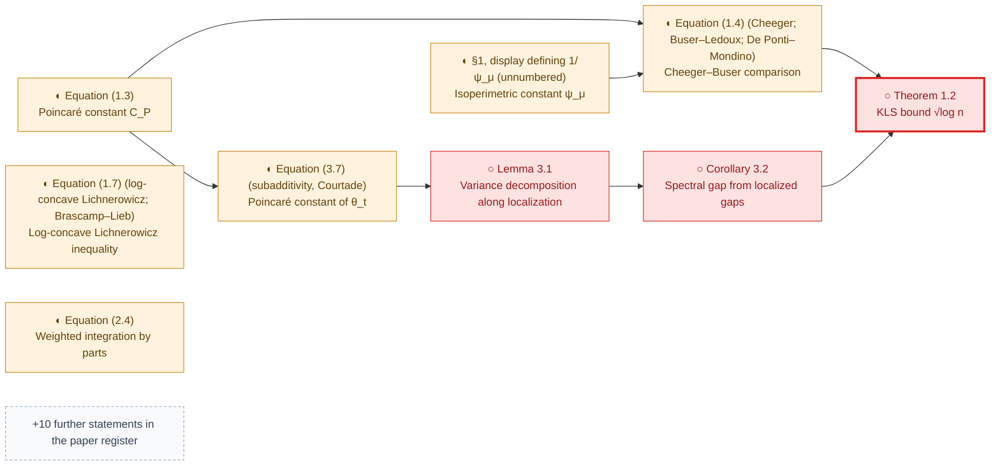
```mermaid
flowchart LR
    Klartag2023_D13["◐ Equation (1.3)<br/>Poincaré constant C_P"]
    Klartag2023_Dpsi["◐ §1, display defining 1/ψ_μ (unnumbered)<br/>Isoperimetric constant ψ_μ"]
    Klartag2023_E14["◐ Equation (1.4) (Cheeger; Buser–Ledoux; De Ponti–Mondino)<br/>Cheeger–Buser comparison"]
    Klartag2023_E17["◐ Equation (1.7) (log-concave Lichnerowicz; Brascamp–Lieb)<br/>Log-concave Lichnerowicz inequality"]
    Klartag2023_T12["○ Theorem 1.2<br/>KLS bound √log n"]
    Klartag2023_E24["◐ Equation (2.4)<br/>Weighted integration by parts"]
    Klartag2023_E37["◐ Equation (3.7) (subadditivity, Courtade)<br/>Poincaré constant of θ_t"]
    Klartag2023_L31["○ Lemma 3.1<br/>Variance decomposition along localization"]
    Klartag2023_C32["○ Corollary 3.2<br/>Spectral gap from localized gaps"]
    Klartag2023_D13 --> Klartag2023_E14
    Klartag2023_Dpsi --> Klartag2023_E14
    Klartag2023_E14 --> Klartag2023_T12
    Klartag2023_C32 --> Klartag2023_T12
    Klartag2023_D13 --> Klartag2023_E37
    Klartag2023_E37 --> Klartag2023_L31
    Klartag2023_L31 --> Klartag2023_C32
    Klartag2023_more["+10 further statements in the paper register"]
    classDef lemma_partial fill:#fff3df,stroke:#c88719,color:#66420d;
    class Klartag2023_D13,Klartag2023_Dpsi,Klartag2023_E14,Klartag2023_E17,Klartag2023_E24,Klartag2023_E37 lemma_partial;
    classDef lemma_pending fill:#fee2e2,stroke:#dc2626,color:#991b1b;
    class Klartag2023_T12,Klartag2023_L31,Klartag2023_C32 lemma_pending;
    style Klartag2023_T12 stroke-width:3px
    classDef lemma_more fill:#f8fafc,stroke:#94a3b8,color:#334155,stroke-dasharray:4 3;
    class Klartag2023_more lemma_more;
```

### Guan (arXiv:2412.09075v1)

11 statements: 10 ○, 1 ⇑. [Full map](LITERATURE.md#guan2024-lemma-map).

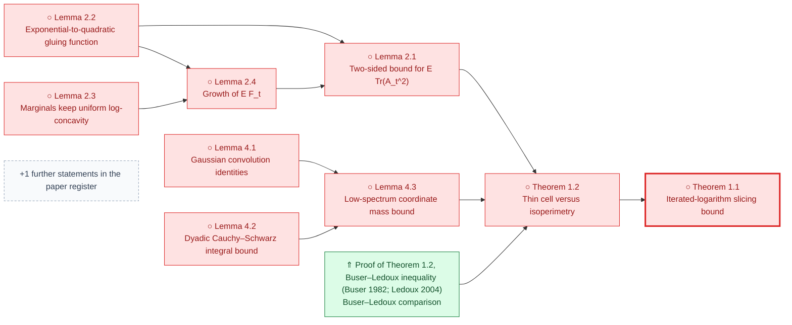
```mermaid
flowchart LR
    Guan2024_T11["○ Theorem 1.1<br/>Iterated-logarithm slicing bound"]
    Guan2024_T12["○ Theorem 1.2<br/>Thin cell versus isoperimetry"]
    Guan2024_L21["○ Lemma 2.1<br/>Two-sided bound for E Tr(A_t^2)"]
    Guan2024_L22["○ Lemma 2.2<br/>Exponential-to-quadratic gluing function"]
    Guan2024_L23["○ Lemma 2.3<br/>Marginals keep uniform log-concavity"]
    Guan2024_L24["○ Lemma 2.4<br/>Growth of E F_t"]
    Guan2024_L41["○ Lemma 4.1<br/>Gaussian convolution identities"]
    Guan2024_L42["○ Lemma 4.2<br/>Dyadic Cauchy–Schwarz integral bound"]
    Guan2024_L43["○ Lemma 4.3<br/>Low-spectrum coordinate mass bound"]
    Guan2024_BL["⇑ Proof of Theorem 1.2, Buser–Ledoux inequality (Buser 1982; Ledoux 2004)<br/>Buser–Ledoux comparison"]
    Guan2024_T12 --> Guan2024_T11
    Guan2024_L21 --> Guan2024_T12
    Guan2024_L43 --> Guan2024_T12
    Guan2024_BL --> Guan2024_T12
    Guan2024_L22 --> Guan2024_L21
    Guan2024_L24 --> Guan2024_L21
    Guan2024_L22 --> Guan2024_L24
    Guan2024_L23 --> Guan2024_L24
    Guan2024_L41 --> Guan2024_L43
    Guan2024_L42 --> Guan2024_L43
    Guan2024_more["+1 further statements in the paper register"]
    classDef lemma_pending fill:#fee2e2,stroke:#dc2626,color:#991b1b;
    class Guan2024_T11,Guan2024_T12,Guan2024_L21,Guan2024_L22,Guan2024_L23,Guan2024_L24,Guan2024_L41,Guan2024_L42,Guan2024_L43 lemma_pending;
    classDef lemma_improved fill:#dcfce7,stroke:#15803d,color:#14532d;
    class Guan2024_BL lemma_improved;
    style Guan2024_T11 stroke-width:3px
    classDef lemma_more fill:#f8fafc,stroke:#94a3b8,color:#334155,stroke-dasharray:4 3;
    class Guan2024_more lemma_more;
```

### Klartag–Lehec (arXiv:2412.15044v1)

13 statements: 13 ○. [Full map](LITERATURE.md#klartaglehecslicing2025-lemma-map).

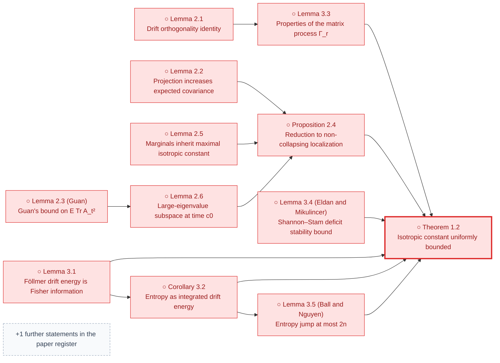
```mermaid
flowchart LR
    KlartagLehecSlicing2025_T12["○ Theorem 1.2<br/>Isotropic constant uniformly bounded"]
    KlartagLehecSlicing2025_L21["○ Lemma 2.1<br/>Drift orthogonality identity"]
    KlartagLehecSlicing2025_L22["○ Lemma 2.2<br/>Projection increases expected covariance"]
    KlartagLehecSlicing2025_L23["○ Lemma 2.3 (Guan)<br/>Guan's bound on E Tr A_t²"]
    KlartagLehecSlicing2025_P24["○ Proposition 2.4<br/>Reduction to non-collapsing localization"]
    KlartagLehecSlicing2025_L25["○ Lemma 2.5<br/>Marginals inherit maximal isotropic constant"]
    KlartagLehecSlicing2025_L26["○ Lemma 2.6<br/>Large-eigenvalue subspace at time c0"]
    KlartagLehecSlicing2025_L31["○ Lemma 3.1<br/>Föllmer drift energy is Fisher information"]
    KlartagLehecSlicing2025_C32["○ Corollary 3.2<br/>Entropy as integrated drift energy"]
    KlartagLehecSlicing2025_L33["○ Lemma 3.3<br/>Properties of the matrix process Γ_r"]
    KlartagLehecSlicing2025_L34["○ Lemma 3.4 (Eldan and Mikulincer)<br/>Shannon–Stam deficit stability bound"]
    KlartagLehecSlicing2025_L35["○ Lemma 3.5 (Ball and Nguyen)<br/>Entropy jump at most 2n"]
    KlartagLehecSlicing2025_P24 --> KlartagLehecSlicing2025_T12
    KlartagLehecSlicing2025_L31 --> KlartagLehecSlicing2025_T12
    KlartagLehecSlicing2025_C32 --> KlartagLehecSlicing2025_T12
    KlartagLehecSlicing2025_L33 --> KlartagLehecSlicing2025_T12
    KlartagLehecSlicing2025_L34 --> KlartagLehecSlicing2025_T12
    KlartagLehecSlicing2025_L35 --> KlartagLehecSlicing2025_T12
    KlartagLehecSlicing2025_L22 --> KlartagLehecSlicing2025_P24
    KlartagLehecSlicing2025_L25 --> KlartagLehecSlicing2025_P24
    KlartagLehecSlicing2025_L26 --> KlartagLehecSlicing2025_P24
    KlartagLehecSlicing2025_L23 --> KlartagLehecSlicing2025_L26
    KlartagLehecSlicing2025_L31 --> KlartagLehecSlicing2025_C32
    KlartagLehecSlicing2025_L21 --> KlartagLehecSlicing2025_L33
    KlartagLehecSlicing2025_C32 --> KlartagLehecSlicing2025_L35
    KlartagLehecSlicing2025_more["+1 further statements in the paper register"]
    classDef lemma_pending fill:#fee2e2,stroke:#dc2626,color:#991b1b;
    class KlartagLehecSlicing2025_T12,KlartagLehecSlicing2025_L21,KlartagLehecSlicing2025_L22,KlartagLehecSlicing2025_L23,KlartagLehecSlicing2025_P24,KlartagLehecSlicing2025_L25,KlartagLehecSlicing2025_L26,KlartagLehecSlicing2025_L31,KlartagLehecSlicing2025_C32,KlartagLehecSlicing2025_L33,KlartagLehecSlicing2025_L34,KlartagLehecSlicing2025_L35 lemma_pending;
    style KlartagLehecSlicing2025_T12 stroke-width:3px
    classDef lemma_more fill:#f8fafc,stroke:#94a3b8,color:#334155,stroke-dasharray:4 3;
    class KlartagLehecSlicing2025_more lemma_more;
```

### Bizeul (arXiv:2501.06854v1)

13 statements: 13 ○. [Full map](LITERATURE.md#bizeul2025-lemma-map).

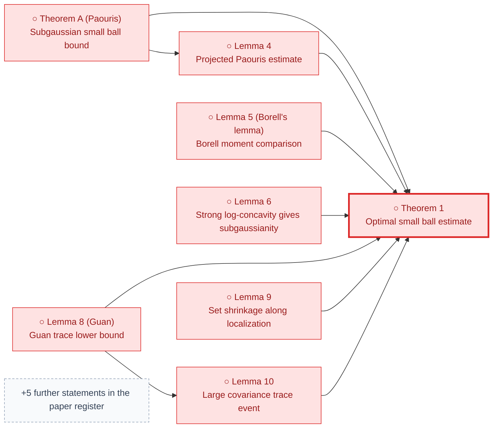
```mermaid
flowchart LR
    Bizeul2025_TA["○ Theorem A (Paouris)<br/>Subgaussian small ball bound"]
    Bizeul2025_T1["○ Theorem 1<br/>Optimal small ball estimate"]
    Bizeul2025_L4["○ Lemma 4<br/>Projected Paouris estimate"]
    Bizeul2025_L5["○ Lemma 5 (Borell's lemma)<br/>Borell moment comparison"]
    Bizeul2025_L6["○ Lemma 6<br/>Strong log-concavity gives subgaussianity"]
    Bizeul2025_L8["○ Lemma 8 (Guan)<br/>Guan trace lower bound"]
    Bizeul2025_L9["○ Lemma 9<br/>Set shrinkage along localization"]
    Bizeul2025_L10["○ Lemma 10<br/>Large covariance trace event"]
    Bizeul2025_TA --> Bizeul2025_T1
    Bizeul2025_L4 --> Bizeul2025_T1
    Bizeul2025_L5 --> Bizeul2025_T1
    Bizeul2025_L6 --> Bizeul2025_T1
    Bizeul2025_L8 --> Bizeul2025_T1
    Bizeul2025_L9 --> Bizeul2025_T1
    Bizeul2025_L10 --> Bizeul2025_T1
    Bizeul2025_TA --> Bizeul2025_L4
    Bizeul2025_L8 --> Bizeul2025_L10
    Bizeul2025_more["+5 further statements in the paper register"]
    classDef lemma_pending fill:#fee2e2,stroke:#dc2626,color:#991b1b;
    class Bizeul2025_TA,Bizeul2025_T1,Bizeul2025_L4,Bizeul2025_L5,Bizeul2025_L6,Bizeul2025_L8,Bizeul2025_L9,Bizeul2025_L10 lemma_pending;
    style Bizeul2025_T1 stroke-width:3px
    classDef lemma_more fill:#f8fafc,stroke:#94a3b8,color:#334155,stroke-dasharray:4 3;
    class Bizeul2025_more lemma_more;
```

### Klartag–Lehec (arXiv:2507.15495v2)

37 statements: 36 ○, 1 ⇑. [Full map](LITERATURE.md#klartaglehecthin2025-lemma-map).

```mermaid
flowchart LR
    KlartagLehecThin2025_T11["○ Theorem 1.1<br/>Thin-shell variance bound"]
    KlartagLehecThin2025_T14["○ Theorem 1.4<br/>H^{-1} bound for coordinates"]
    KlartagLehecThin2025_L21["○ Lemma 2.1<br/>Pathwise flow and its derivative"]
    KlartagLehecThin2025_D22["○ Definition 2.2<br/>Flow map G_{t,w}"]
    KlartagLehecThin2025_L23["○ Lemma 2.3<br/>Continuity and adaptedness of flow"]
    KlartagLehecThin2025_L24["○ Lemma 2.4<br/>Lipschitz bound for the flow"]
    KlartagLehecThin2025_P25["○ Proposition 2.5<br/>Law of the driven flow"]
    KlartagLehecThin2025_C26["○ Corollary 2.6<br/>Large-time limit is the tilt"]
    KlartagLehecThin2025_L41["○ Lemma 4.1<br/>Monotone normalized flow distance"]
    KlartagLehecThin2025_P42["○ Proposition 4.2<br/>Wasserstein bound via parallel coupling"]
    KlartagLehecThin2025_C43["○ Corollary 4.3<br/>Infinitesimal Wasserstein bound"]
    KlartagLehecThin2025_L44["○ Lemma 4.4<br/>H^{-1} norm via W_2"]
    KlartagLehecThin2025_C45["○ Corollary 4.5<br/>H^{-1} sum via derivative"]
    KlartagLehecThin2025_P46["○ Proposition 4.6<br/>Product-integral Hilbert–Schmidt bound"]
    KlartagLehecThin2025_L47["⇑ Lemma 4.7<br/>Majorization Gronwall comparison"]
    KlartagLehecThin2025_C410["○ Corollary 4.10<br/>H^{-1} bound by eigenvalues"]
    KlartagLehecThin2025_P51["○ Proposition 5.1<br/>Few large eigenvalues, stopped"]
    KlartagLehecThin2025_L52["○ Lemma 5.2 (Guan)<br/>Guan's three-tensor bound"]
    KlartagLehecThin2025_L53["○ Lemma 5.3<br/>Itô drift of trace functionals"]
    KlartagLehecThin2025_L54["○ Lemma 5.4<br/>Gronwall drift bound for f"]
    KlartagLehecThin2025_L55["○ Lemma 5.5<br/>Existence of test functions f_{D,r}"]
    KlartagLehecThin2025_C61["○ Corollary 6.1<br/>Stopping-time tail and moment"]
    KlartagLehecThin2025_T62["○ Theorem 6.2<br/>Exponential eigenvalue integral bound"]
    KlartagLehecThin2025_T14 --> KlartagLehecThin2025_T11
    KlartagLehecThin2025_C410 --> KlartagLehecThin2025_T14
    KlartagLehecThin2025_T62 --> KlartagLehecThin2025_T14
    KlartagLehecThin2025_L21 --> KlartagLehecThin2025_D22
    KlartagLehecThin2025_D22 --> KlartagLehecThin2025_L23
    KlartagLehecThin2025_L23 --> KlartagLehecThin2025_L24
    KlartagLehecThin2025_D22 --> KlartagLehecThin2025_P25
    KlartagLehecThin2025_P25 --> KlartagLehecThin2025_C26
    KlartagLehecThin2025_D22 --> KlartagLehecThin2025_L41
    KlartagLehecThin2025_C26 --> KlartagLehecThin2025_P42
    KlartagLehecThin2025_L41 --> KlartagLehecThin2025_P42
    KlartagLehecThin2025_P42 --> KlartagLehecThin2025_C43
    KlartagLehecThin2025_L24 --> KlartagLehecThin2025_C43
    KlartagLehecThin2025_L21 --> KlartagLehecThin2025_C43
    KlartagLehecThin2025_L44 --> KlartagLehecThin2025_C45
    KlartagLehecThin2025_C43 --> KlartagLehecThin2025_C45
    KlartagLehecThin2025_L47 --> KlartagLehecThin2025_P46
    KlartagLehecThin2025_C45 --> KlartagLehecThin2025_C410
    KlartagLehecThin2025_P46 --> KlartagLehecThin2025_C410
    KlartagLehecThin2025_L54 --> KlartagLehecThin2025_P51
    KlartagLehecThin2025_L55 --> KlartagLehecThin2025_P51
    KlartagLehecThin2025_L53 --> KlartagLehecThin2025_L54
    KlartagLehecThin2025_L52 --> KlartagLehecThin2025_L54
    KlartagLehecThin2025_P51 --> KlartagLehecThin2025_C61
    KlartagLehecThin2025_C61 --> KlartagLehecThin2025_T62
    KlartagLehecThin2025_more["+14 further statements in the paper register"]
    classDef lemma_pending fill:#fee2e2,stroke:#dc2626,color:#991b1b;
    class KlartagLehecThin2025_T11,KlartagLehecThin2025_T14,KlartagLehecThin2025_L21,KlartagLehecThin2025_D22,KlartagLehecThin2025_L23,KlartagLehecThin2025_L24,KlartagLehecThin2025_P25,KlartagLehecThin2025_C26,KlartagLehecThin2025_L41,KlartagLehecThin2025_P42,KlartagLehecThin2025_C43,KlartagLehecThin2025_L44,KlartagLehecThin2025_C45,KlartagLehecThin2025_P46,KlartagLehecThin2025_C410,KlartagLehecThin2025_P51,KlartagLehecThin2025_L52,KlartagLehecThin2025_L53,KlartagLehecThin2025_L54,KlartagLehecThin2025_L55,KlartagLehecThin2025_C61,KlartagLehecThin2025_T62 lemma_pending;
    classDef lemma_improved fill:#dcfce7,stroke:#15803d,color:#14532d;
    class KlartagLehecThin2025_L47 lemma_improved;
    style KlartagLehecThin2025_T11 stroke-width:3px
    classDef lemma_more fill:#f8fafc,stroke:#94a3b8,color:#334155,stroke-dasharray:4 3;
    class KlartagLehecThin2025_more lemma_more;
```

### Chen–Klartag (arXiv:2607.23307v1)

17 statements: 17 ○. [Full map](LITERATURE.md#chenklartag2026-lemma-map).

```mermaid
flowchart LR
    ChenKlartag2026_T11["○ Theorem 1.1<br/>Sharp thin-shell variance bound"]
    ChenKlartag2026_T14["○ Theorem 1.4<br/>Sharp H^{-1} coordinate bound"]
    ChenKlartag2026_T15["○ Theorem 1.5<br/>Second trace moment of H"]
    ChenKlartag2026_L31["○ Lemma 3.1<br/>Exact identity LH+H = A+Q"]
    ChenKlartag2026_L32["○ Lemma 3.2<br/>Pointwise formula for L tr(H²)"]
    ChenKlartag2026_L33["○ Lemma 3.3<br/>Integrated trace identity"]
    ChenKlartag2026_L34["○ Lemma 3.4<br/>Poincaré bound for entries of H"]
    ChenKlartag2026_L35["○ Lemma 3.5<br/>Cyclic identity q_2 ≥ d_2"]
    ChenKlartag2026_LA1["○ Lemma A.1<br/>Energy cutoffs and finite-energy domain"]
    ChenKlartag2026_LA2["○ Lemma A.2<br/>Vanishing integral of LG"]
    ChenKlartag2026_LA3["○ Lemma A.3<br/>Euclidean integration-by-parts identities"]
    ChenKlartag2026_T14 --> ChenKlartag2026_T11
    ChenKlartag2026_T15 --> ChenKlartag2026_T14
    ChenKlartag2026_L33 --> ChenKlartag2026_T15
    ChenKlartag2026_L34 --> ChenKlartag2026_T15
    ChenKlartag2026_L35 --> ChenKlartag2026_T15
    ChenKlartag2026_L31 --> ChenKlartag2026_L32
    ChenKlartag2026_L32 --> ChenKlartag2026_L33
    ChenKlartag2026_LA2 --> ChenKlartag2026_L33
    ChenKlartag2026_L33 --> ChenKlartag2026_L34
    ChenKlartag2026_LA1 --> ChenKlartag2026_L34
    ChenKlartag2026_LA3 --> ChenKlartag2026_L34
    ChenKlartag2026_LA1 --> ChenKlartag2026_LA2
    ChenKlartag2026_more["+6 further statements in the paper register"]
    classDef lemma_pending fill:#fee2e2,stroke:#dc2626,color:#991b1b;
    class ChenKlartag2026_T11,ChenKlartag2026_T14,ChenKlartag2026_T15,ChenKlartag2026_L31,ChenKlartag2026_L32,ChenKlartag2026_L33,ChenKlartag2026_L34,ChenKlartag2026_L35,ChenKlartag2026_LA1,ChenKlartag2026_LA2,ChenKlartag2026_LA3 lemma_pending;
    style ChenKlartag2026_T11 stroke-width:3px
    classDef lemma_more fill:#f8fafc,stroke:#94a3b8,color:#334155,stroke-dasharray:4 3;
    class ChenKlartag2026_more lemma_more;
```

### Letwin (arXiv:2607.24164v1)

25 statements: 2 ✓, 17 ◐, 4 ○, 2 ⇑. [Full map](LITERATURE.md#letwin2026-lemma-map).

```mermaid
flowchart LR
    Letwin2026_DISO["✓ Section 1, definition of isotropic (unnumbered)<br/>Isotropic random vector"]
    Letwin2026_DCP["◐ Equation (1.1), definition of C_P(mu)<br/>Poincare constant C_P"]
    Letwin2026_DPSI["◐ Section 1, displays defining 1/psi_mu and psi_n (unnumbered)<br/>Isoperimetric and KLS constants"]
    Letwin2026_ECMP["◐ Section 1, unnumbered display (Cheeger; Buser, Ledoux; De Ponti and Mondino)<br/>Cheeger and Buser comparison"]
    Letwin2026_CONJ["◐ Section 1, statement of the KLS conjecture (unnumbered)<br/>KLS conjecture"]
    Letwin2026_T11["○ Theorem 1.1<br/>KLS constant O(log^{1/4} n)"]
    Letwin2026_T12["◐ Theorem 1.2<br/>Quadratic-form Poincare inequality"]
    Letwin2026_CZ14["⇑ Proof of Theorem 1.2, p. 14 (unnumbered display preceding (2.21))<br/>Covariance of the transported vector"]
    Letwin2026_L21["○ Lemma 2.1 (Cordero-Erausquin and Klartag [21, Theorem 2])<br/>Existence of moment maps"]
    Letwin2026_L22["○ Lemma 2.2 (Klartag [41])<br/>Regularity of the moment map"]
    Letwin2026_L23["◐ Lemma 2.3<br/>Hessian of phi has mean Id"]
    Letwin2026_E23["◐ Equation (2.3), p. 6 (unnumbered display)<br/>Product rule for the diffusion generator"]
    Letwin2026_L24["◐ Lemma 2.4<br/>Twice-differentiated Monge-Ampere equation"]
    Letwin2026_T25["◐ Theorem 2.5<br/>Key moment-map Hessian bound"]
    Letwin2026_D26["◐ Definition 2.6<br/>Stein kernel"]
    Letwin2026_L27["◐ Lemma 2.7 (Fathi [29, Theorem 2.3])<br/>Moment map gives Stein kernel"]
    Letwin2026_P28["◐ Proposition 2.8 (Barthe and Klartag [7, Proposition 10])<br/>H^{-1} variance inequality"]
    Letwin2026_L29["◐ Lemma 2.9<br/>Stein kernel bounds H^{-1} norm"]
    Letwin2026_LA1["✓ Lemma A.1<br/>Reduction to regular measures"]
    Letwin2026_LA2["○ Lemma A.2<br/>Reduction to invertible M"]
    Letwin2026_LA3["◐ Lemma A.3<br/>Integration by parts under nu"]
    Letwin2026_LA4["⇑ Lemma A.4<br/>Cutoffs with small generator"]
    Letwin2026_LA5["◐ Lemma A.5<br/>Mean zero of L f"]
    Letwin2026_LA6["◐ Lemma A.6<br/>Brascamp-Lieb for nu"]
    Letwin2026_LA7["◐ Lemma A.7<br/>Extended Stein identity"]
    Letwin2026_DISO --> Letwin2026_DPSI
    Letwin2026_DCP --> Letwin2026_ECMP
    Letwin2026_DPSI --> Letwin2026_ECMP
    Letwin2026_DISO --> Letwin2026_CONJ
    Letwin2026_DCP --> Letwin2026_CONJ
    Letwin2026_DPSI --> Letwin2026_CONJ
    Letwin2026_ECMP --> Letwin2026_CONJ
    Letwin2026_T12 --> Letwin2026_T11
    Letwin2026_ECMP --> Letwin2026_T11
    Letwin2026_DISO --> Letwin2026_T11
    Letwin2026_DCP --> Letwin2026_T11
    Letwin2026_DPSI --> Letwin2026_T11
    Letwin2026_L21 --> Letwin2026_T12
    Letwin2026_L22 --> Letwin2026_T12
    Letwin2026_L27 --> Letwin2026_T12
    Letwin2026_D26 --> Letwin2026_T12
    Letwin2026_T25 --> Letwin2026_T12
    Letwin2026_P28 --> Letwin2026_T12
    Letwin2026_L29 --> Letwin2026_T12
    Letwin2026_LA1 --> Letwin2026_T12
    Letwin2026_LA2 --> Letwin2026_T12
    Letwin2026_CZ14 --> Letwin2026_T12
    Letwin2026_L21 --> Letwin2026_L22
    Letwin2026_LA1 --> Letwin2026_L22
    Letwin2026_L22 --> Letwin2026_L23
    Letwin2026_LA3 --> Letwin2026_L23
    Letwin2026_DISO --> Letwin2026_L23
    Letwin2026_L22 --> Letwin2026_L24
    Letwin2026_L22 --> Letwin2026_T25
    Letwin2026_L23 --> Letwin2026_T25
    Letwin2026_L24 --> Letwin2026_T25
    Letwin2026_LA3 --> Letwin2026_T25
    Letwin2026_LA5 --> Letwin2026_T25
    Letwin2026_LA6 --> Letwin2026_T25
    Letwin2026_L22 --> Letwin2026_L27
    Letwin2026_D26 --> Letwin2026_L27
    Letwin2026_D26 --> Letwin2026_L29
    Letwin2026_LA7 --> Letwin2026_L29
    Letwin2026_DISO --> Letwin2026_LA1
    Letwin2026_L22 --> Letwin2026_LA3
    Letwin2026_LA1 --> Letwin2026_LA3
    Letwin2026_L22 --> Letwin2026_LA4
    Letwin2026_LA1 --> Letwin2026_LA4
    Letwin2026_LA4 --> Letwin2026_LA5
    Letwin2026_L22 --> Letwin2026_LA6
    Letwin2026_LA1 --> Letwin2026_LA6
    Letwin2026_D26 --> Letwin2026_LA7
    classDef lemma_formalized fill:#dbeafe,stroke:#2563eb,color:#1e3a8a;
    class Letwin2026_DISO,Letwin2026_LA1 lemma_formalized;
    classDef lemma_partial fill:#fff3df,stroke:#c88719,color:#66420d;
    class Letwin2026_DCP,Letwin2026_DPSI,Letwin2026_ECMP,Letwin2026_CONJ,Letwin2026_T12,Letwin2026_L23,Letwin2026_E23,Letwin2026_L24,Letwin2026_T25,Letwin2026_D26,Letwin2026_L27,Letwin2026_P28,Letwin2026_L29,Letwin2026_LA3,Letwin2026_LA5,Letwin2026_LA6,Letwin2026_LA7 lemma_partial;
    classDef lemma_pending fill:#fee2e2,stroke:#dc2626,color:#991b1b;
    class Letwin2026_T11,Letwin2026_L21,Letwin2026_L22,Letwin2026_LA2 lemma_pending;
    classDef lemma_improved fill:#dcfce7,stroke:#15803d,color:#14532d;
    class Letwin2026_CZ14,Letwin2026_LA4 lemma_improved;
    style Letwin2026_T11 stroke-width:3px
```

### Bizeul–Klartag–Lehec (arXiv:2610.05474v1)

27 statements: 6 ✓, 6 ◐, 2 ○, 13 ⇑. [Full map](LITERATURE.md#bkl2026-lemma-map).

```mermaid
flowchart LR
    BKL2026_T11["◐ Theorem 1.1, p. 2<br/>Dimension-free Poincaré constant"]
    BKL2026_L21["◐ Lemma 2.1, p. 7<br/>Centered inverse of the generator"]
    BKL2026_L22["✓ Lemma 2.2, p. 9<br/>Partial symmetrization of tensors"]
    BKL2026_T31["✓ Theorem 3.1, p. 10<br/>Taylor-coefficient criterion"]
    BKL2026_L32["⇑ Lemma 3.2, p. 11<br/>Near-symmetric gradient"]
    BKL2026_EQ3536["⇑ Equations (35)–(36), p. 11 (unnumbered)<br/>Energy drops"]
    BKL2026_L33["⇑ Lemma 3.3, p. 12<br/>Approximate symmetry of iterates"]
    BKL2026_L34["⇑ Lemma 3.4, p. 13<br/>Bochner step"]
    BKL2026_C35["⇑ Corollary 3.5, p. 13<br/>Vanishing of v_N"]
    BKL2026_L36["⇑ Lemma 3.6, p. 14<br/>Taylor tensors of the generator"]
    BKL2026_C37["⇑ Corollary 3.7, p. 15<br/>Taylor tensors of the iterates"]
    BKL2026_L38["⇑ Lemma 3.8, p. 15<br/>Taylor-tensor recursion"]
    BKL2026_L39["⇑ Lemma 3.9, p. 16<br/>Summation bound"]
    BKL2026_T41["◐ Theorem 4.1, p. 18<br/>Cumulant bounds"]
    BKL2026_L42["◐ Lemma 4.2, p. 18<br/>Third cumulant"]
    BKL2026_L43["◐ Lemma 4.3, p. 20<br/>Cumulant dynamics"]
    BKL2026_E7274["⇑ Equations (72) and (74), pp. 20–21 (spatial step of the proof of Lemma 4.3)<br/>Grouped drift expansion"]
    BKL2026_L51["✓ Lemma 5.1, p. 22<br/>Drift inequality"]
    BKL2026_L52["○ Lemma 5.2, p. 24<br/>Integrated drift bound"]
    BKL2026_P71["✓ Proposition 7.1, p. 28<br/>Suspension"]
    BKL2026_E12["✓ Section 2, (12), p. 5 (unnumbered)<br/>Regular log-concave measures"]
    BKL2026_E2628["✓ Equations (26)–(28), p. 9 (unnumbered)<br/>Tilts, tilt averages and Taylor tensors"]
    BKL2026_EQ15["⇑ Equation (15), p. 6 (unnumbered)<br/>Integration by parts on 𝒜"]
    BKL2026_EQ16["⇑ Equation (16), p. 6 (unnumbered)<br/>Integrated Bochner formula on 𝒜"]
    BKL2026_E48["⇑ Equation (48), p. 14 (unnumbered)<br/>Tilted generator identity"]
    BKL2026_E67["◐ Equation (67), p. 19 (unnumbered display) and the compact stage before it<br/>Localization posterior and its parameter dependence"]
    BKL2026_T31 --> BKL2026_T11
    BKL2026_T41 --> BKL2026_T11
    BKL2026_P71 --> BKL2026_T11
    BKL2026_L21 --> BKL2026_T31
    BKL2026_L22 --> BKL2026_T31
    BKL2026_L32 --> BKL2026_T31
    BKL2026_L33 --> BKL2026_T31
    BKL2026_L34 --> BKL2026_T31
    BKL2026_C35 --> BKL2026_T31
    BKL2026_L36 --> BKL2026_T31
    BKL2026_C37 --> BKL2026_T31
    BKL2026_L38 --> BKL2026_T31
    BKL2026_L39 --> BKL2026_T31
    BKL2026_L21 --> BKL2026_L32
    BKL2026_L34 --> BKL2026_EQ3536
    BKL2026_L32 --> BKL2026_L33
    BKL2026_L21 --> BKL2026_L33
    BKL2026_L32 --> BKL2026_L34
    BKL2026_EQ16 --> BKL2026_L34
    BKL2026_L34 --> BKL2026_C35
    BKL2026_E2628 --> BKL2026_L36
    BKL2026_E48 --> BKL2026_L36
    BKL2026_L36 --> BKL2026_C37
    BKL2026_C37 --> BKL2026_L38
    BKL2026_L33 --> BKL2026_L38
    BKL2026_L22 --> BKL2026_L38
    BKL2026_L36 --> BKL2026_L39
    BKL2026_L42 --> BKL2026_T41
    BKL2026_L43 --> BKL2026_T41
    BKL2026_L51 --> BKL2026_T41
    BKL2026_L52 --> BKL2026_T41
    BKL2026_E7274 --> BKL2026_L43
    BKL2026_L43 --> BKL2026_L51
    BKL2026_L42 --> BKL2026_L51
    BKL2026_L51 --> BKL2026_L52
    BKL2026_EQ15 --> BKL2026_EQ16
    BKL2026_E2628 --> BKL2026_E48
    BKL2026_more["+1 further statements in the paper register"]
    classDef lemma_formalized fill:#dbeafe,stroke:#2563eb,color:#1e3a8a;
    class BKL2026_L22,BKL2026_T31,BKL2026_L51,BKL2026_P71,BKL2026_E12,BKL2026_E2628 lemma_formalized;
    classDef lemma_partial fill:#fff3df,stroke:#c88719,color:#66420d;
    class BKL2026_T11,BKL2026_L21,BKL2026_T41,BKL2026_L42,BKL2026_L43,BKL2026_E67 lemma_partial;
    classDef lemma_pending fill:#fee2e2,stroke:#dc2626,color:#991b1b;
    class BKL2026_L52 lemma_pending;
    classDef lemma_improved fill:#dcfce7,stroke:#15803d,color:#14532d;
    class BKL2026_L32,BKL2026_EQ3536,BKL2026_L33,BKL2026_L34,BKL2026_C35,BKL2026_L36,BKL2026_C37,BKL2026_L38,BKL2026_L39,BKL2026_E7274,BKL2026_EQ15,BKL2026_EQ16,BKL2026_E48 lemma_improved;
    style BKL2026_T11 stroke-width:3px
    classDef lemma_more fill:#f8fafc,stroke:#94a3b8,color:#334155,stroke-dasharray:4 3;
    class BKL2026_more lemma_more;
```
<!-- END GENERATED LEMMAS -->

## KLS literature through July 2026

<!-- BEGIN GENERATED LITERATURE -->
**28 selected sources, from foundational results to July 2026.**

The [paper-by-paper literature register](LITERATURE.md) records statements, publication
versions, exact local coverage and remaining work. The general KLS-bound milestones
in this diagram are all still pending locally; completed supporting results appear in
the paper and node registers. Dashed edges mean chronology or related methods, not proof.

```mermaid
flowchart TB
    subgraph L_bounds["General KLS frontier — inverse Cheeger convention"]
    direction LR
    L_KLS1995["1995 · KLS<br/>ψₙ = O(n^(1/2))"]
    L_Eldan2013["2013 · Eldan<br/>Stochastic localization"]
    L_LeeVempala2024["2016/17 · Lee–Vempala<br/>ψₙ = O(n^(1/4))"]
    L_Chen2021["2020/21 · Chen<br/>ψₙ = n^o(1)"]
    L_KlartagLehec2022["2022 · Klartag–Lehec<br/>ψₙ = O((log n)^5)"]
    L_JambulapatiLeeVempala2022["2022 · Jambulapati–Lee–Vempala<br/>ψₙ = O((log n)^3.2226)"]
    L_Klartag2023["2023 · Klartag<br/>ψₙ = O((log n)^(1/2))"]
    L_Letwin2026["27 July 2026 · Letwin<br/>ψₙ = O((log n)^(1/4))"]
    L_BKL2026["4 Oct 2026 · Bizeul–Klartag–Lehec<br/>C_P ≤ C claimed (preprint)"]
    end
    subgraph L_shell["Related breakthroughs — do not imply dimension-free KLS"]
    direction LR
    L_Guan2024["2024 · Guan<br/>Localization estimates"]
    L_KlartagLehecSlicing2025["2024/25 · Klartag–Lehec<br/>Slicing resolved"]
    L_KlartagLehecThin2025["2025 · Klartag–Lehec<br/>Thin shell resolved"]
    L_ChenKlartag2026["25 July 2026 · Chen–Klartag<br/>Sharp thin shell: 8n"]
    end
    subgraph L_moments["Moment-measure background for the July papers"]
    direction LR
    L_CorderoKlartag2015["2015 · Cordero-Erausquin–Klartag<br/>Moment-measure existence"]
    L_Klartag2014Moment["2014 · Klartag<br/>Moment-measure geometry"]
    L_Fathi2019["2019 · Fathi<br/>Stein kernels"]
    end
    L_KLS1995 -. "later milestone" .-> L_Eldan2013
    L_Eldan2013 -. "later milestone" .-> L_LeeVempala2024
    L_LeeVempala2024 -. "later milestone" .-> L_Chen2021
    L_Chen2021 -. "later milestone" .-> L_KlartagLehec2022
    L_KlartagLehec2022 -. "later milestone" .-> L_JambulapatiLeeVempala2022
    L_JambulapatiLeeVempala2022 -. "later milestone" .-> L_Klartag2023
    L_Klartag2023 -. "later milestone" .-> L_Letwin2026
    L_Guan2024 -. "related input / method" .-> L_KlartagLehecSlicing2025
    L_Guan2024 -. "related input / method" .-> L_KlartagLehecThin2025
    L_KlartagLehecThin2025 -. "related input / method" .-> L_ChenKlartag2026
    L_CorderoKlartag2015 -. "related input / method" .-> L_Klartag2014Moment
    L_CorderoKlartag2015 -. "related input / method" .-> L_Fathi2019
    L_Klartag2014Moment -. "related input / method" .-> L_ChenKlartag2026
    L_Klartag2014Moment -. "related input / method" .-> L_Letwin2026
    L_Fathi2019 -. "related input / method" .-> L_Letwin2026
    L_Letwin2026 -. "later milestone" .-> L_BKL2026
    classDef literature fill:#eef2ff,stroke:#64748b,color:#172554;
    classDef recent fill:#fff4dc,stroke:#b7791f,color:#663c00;
    class L_KLS1995,L_Eldan2013,L_LeeVempala2024,L_Chen2021,L_KlartagLehec2022,L_JambulapatiLeeVempala2022,L_Klartag2023,L_Letwin2026,L_BKL2026,L_Guan2024,L_KlartagLehecSlicing2025,L_KlartagLehecThin2025,L_ChenKlartag2026,L_CorderoKlartag2015,L_Klartag2014Moment,L_Fathi2019 literature;
    class L_ChenKlartag2026,L_Letwin2026 recent;
    click L_KLS1995 href "https://link.springer.com/article/10.1007/BF02574061" "Primary source" _blank
    click L_Eldan2013 href "https://arxiv.org/abs/1203.0893" "Primary source" _blank
    click L_LeeVempala2024 href "https://annals.math.princeton.edu/2024/199-3/p02" "Primary source" _blank
    click L_Chen2021 href "https://arxiv.org/abs/2011.13661" "Primary source" _blank
    click L_KlartagLehec2022 href "https://arxiv.org/html/2203.15551v2" "Primary source" _blank
    click L_JambulapatiLeeVempala2022 href "https://arxiv.org/html/2208.11644v2" "Primary source" _blank
    click L_Klartag2023 href "https://arxiv.org/html/2303.14938v2" "Primary source" _blank
    click L_Letwin2026 href "https://arxiv.org/html/2607.24164v1" "Primary source" _blank
    click L_BKL2026 href "https://arxiv.org/abs/2610.05474v1" "Primary source" _blank
    click L_Guan2024 href "https://arxiv.org/html/2412.09075v1" "Primary source" _blank
    click L_KlartagLehecSlicing2025 href "https://arxiv.org/abs/2412.15044" "Primary source" _blank
    click L_KlartagLehecThin2025 href "https://arxiv.org/abs/2507.15495v2" "Primary source" _blank
    click L_ChenKlartag2026 href "https://arxiv.org/html/2607.23307v1" "Primary source" _blank
    click L_CorderoKlartag2015 href "https://arxiv.org/abs/1304.0630" "Primary source" _blank
    click L_Klartag2014Moment href "https://arxiv.org/abs/1309.2767" "Primary source" _blank
    click L_Fathi2019 href "https://arxiv.org/abs/1804.04699" "Primary source" _blank
```

| Latest source | Literature result | Our Lean status |
| --- | --- | --- |
| [Chen–Klartag, 25 July 2026](https://arxiv.org/html/2607.23307v1) · Preprint (v1) | For isotropic log-concave X: Var(‖X‖²) ≤ 8n and ‖T₃(X)‖²_HS ≤ 4n. The constants are sharp. |  |
| [Letwin, 27 July 2026](https://arxiv.org/html/2607.24164v1) · Preprint (v1) | For isotropic log-concave X and symmetric M, Var(XᵀMX) ≤ 8‖M‖²_HS = 2 E‖∇(XᵀMX)‖². For n ≥ 2, ψₙ = O((log n)^(1/4)), hence C_P = O(√log n). |  |

Here ψ is the inverse Cheeger constant, so its logarithmic exponent is half the
Poincaré exponent. The sharp thin-shell result does not resolve dimension-free KLS.
See the [full tables and normalization](LITERATURE.md#constant-conventions).
<!-- END GENERATED LITERATURE -->

## Proof progress tree

<!-- BEGIN GENERATED DATE -->
Last updated: **2026-10-12**.

 ·  ·  · 
<!-- END GENERATED DATE -->
Scalar sharp Sard, vector coarea through locally Lipschitz maps, the Cheeger infimum equality,
heat-semigroup construction, and the full numerical Cheeger–Buser comparison are formalized
in Lean. The general π bound uses actual Gaussian smoothing and a Cheeger test stability
argument; no individual-domain perimeter limit is asserted.
The scoped metric BV comparison includes closed-support identification for finite-dimensional
log-concave laws, exact test-class relaxation infima, and relaxed lower Minkowski content.
**Next step:** De Ponti–Mondino Lemmas 3.2 and 3.3; the ADMG Theorem 3.6 paper-target
certificate is remotely certified (see the [paper lemma map](#paper-lemma-map)).
The priority-1 Bakry–Émery target waits for the Bakry–Gentil–Ledoux source text.
The locally Lipschitz classes on nonproper spaces and the general metric-measure/RCD
comparison bridges remain open. The extended ADMG sections 2–3 finite-target
scope (2026-10-01) is frozen and locally verified. Lemma 2.1's equality of the relaxed lower and upper
contents now holds for every Borel measure at measurable finite-mass targets, and on proper
spaces the Remark 3.5 locally Lipschitz classes (global or compact-set L1) give the
bounded-support perimeter at such targets for every Borel measure. Remark 3.4's bounded-support reduction,
Lemma 2.1's actual radius recovery, both recoveries and both relaxed identities
are proved at measurable finite-mass Borel targets for measures finite on bounded
Borel sets, including infinite total mass and nonproper spaces. The full Lemma 3.2
chain retains the actual right-radius liminf of integrated open-ball growth under
finite positive-support-neighborhood mass and nonnegativity. No new ledger
certificate or remote CI is claimed. The locally Lipschitz classes on nonproper
spaces, nonconvex support transfer and general RCD comparisons are
outside this completed proof scope; the dimension-free KLS routes remain open.
The content chain proves lower content `≤` upper content, almost-everywhere differentiability of
the monotone radius mass, the derivative and integrated bounds on the upper content of
thickenings, the local-slope Minkowski coarea inequality, the recovery of every measurable set of
finite lower content and of every set of finite BV perimeter by measurable sets converging in
`L¹`, and the equality of the relaxed upper Minkowski content with the perimeter and with the
relaxed lower content, on arbitrary metric spaces with a finite Borel measure (phases 24–29,
independently accepted; the generic coarea uses the lower semicontinuous open-ball supremum;
scaling, the zero measure and normalization are explicit). The upper-content chain for measures finite on bounded sets
with infinite total mass is proved at measurable finite-mass targets (above); pointwise
equality of the upper content with the perimeter, general RCD comparisons and the
dimension-free KLS routes are not proved locally.

Complement symmetry for finite Borel
measures, including the closed intrinsic support law, is formalized in Lean, and so is
the equality of the half-mass and symmetric BV Cheeger constants on every probability
metric space; for a finite measure, globally Lipschitz approximants converging in global
`L¹` may replace bounded-support tests (on a proper metric space also locally Lipschitz
approximants, even under `L¹` convergence on every closed ball only), epsilon recovery tests exist below every threshold
above the perimeter, and every finite perimeter is the limit of the costs of an explicitly
selected approximating sequence; the perimeter is lower semicontinuous under global `L¹`
convergence of measurable sets and is at most the outer Minkowski content of every measurable
set for every probability law (one inequality); the Minkowski coarea inequality holds with the
actual local slope for every globally Lipschitz function, and every test has a quantitative
superlevel selection (content at most `cost / (1 - 2δ) + ε`, indicator error at most its error
over `δ`), and every set of finite BV perimeter has explicit measurable Minkowski recovery sets
(`L¹` convergence, contents converging to the perimeter), whose masses and, for mass in
`(0, 1)`, symmetric Cheeger quotients converge. Consequently the symmetric and half-mass BV
Cheeger constants equal the Minkowski Cheeger constant for every probability law on a normed
space, and for the intrinsic coordinate law they equal the isoperimetric constant (an equality of
infima). Restriction to the closed measure support does not increase the metric BV perimeter
(one inequality), with equality under a nonexpansive retraction onto a full-mass subset, in
particular for every law on a Hilbert space with convex closed support; for every
finite-dimensional log-concave law the BV Cheeger constant on the closed intrinsic support
therefore equals the isoperimetric constant. The relaxation infimum over globally Lipschitz
approximants equals this perimeter for finite measures, and over locally Lipschitz
approximants on proper spaces (with global or compact-set `L¹` convergence), in particular on
the closed intrinsic support, and the relaxed
lower Minkowski set infimum equals it for probability laws on normed spaces; `L¹_loc`
convergence beyond proper spaces with finite measures, and nonconvex supports remain open. The four dimension-free
[KLS routes](#proof-progress-tree) remain open.
These statuses record local proofs and do not claim a remote CI receipt.
Upstream mathematical proofs alone do not earn a ✓.

One large diagram shows the four sufficient routes and their shared proof infrastructure.
Arrows point toward KLS: AND within each route, OR between routes. Dotted arrows show context. The vector-coarea extension is shown separately and does not
assert an additional implication to KLS.
The diagram uses a larger font and full canvas width; [open its source](TREE.mmd) for a separate view.

<!-- BEGIN GENERATED TREE -->
```mermaid
%%{init: {"themeVariables": {"fontSize": "20px"}, "flowchart": {"useMaxWidth": false, "nodeSpacing": 40, "rankSpacing": 65}}}%%
flowchart LR
    subgraph FOUND["Shared foundations"]
    DENS["✓ Log-concave density<br/>Intrinsic support"]
    NORM["✓ Affine / isotropic<br/>Reduction"]
    FORMS["✓ Closed forms<br/>Dirichlet property"]
    ENERGY["✓ Canonical energy<br/>= 2 × Cheeger energy"]
    CONST["✓ Poincaré frontend<br/>Equivalence"]
    end
    subgraph ANALYSIS["Analytic comparison"]
    MEAS["✓ Slice measurability"]
    GRAPH["✓ Open-domain<br/>Graph area"]
    REG["✓ Regular-domain<br/>Coarea"]
    CRIT["✓ Critical-slice nullity"]
    C1["✓ General C¹ coarea"]
    WHIT["✓ Compact Whitney jets<br/>Exact C¹ pieces"]
    LIP["✓ Coarea: Lipschitz<br/>and locally Lipschitz"]
    GG["✓ Global Gauss–Green"]
    REC["✓ Smooth recovery"]
    FWD["✓ h_M ≤ h_S"]
    SARD["✓ Scalar Sard<br/>Sharp finite regularity"]
    SCI["✓ Cheeger superlevel<br/>Integral bound"]
    CUT["✓ Distance cutoffs"]
    REV["✓ h_S ≤ h_M"]
    EQ["✓ h_M = h_S"]
    FRONT["✓ Density Cheeger<br/>Identification"]
    CB["✓ Cheeger–Buser<br/>4 and pi bounds"]
    MINK["✓ Minkowski coarea"]
    BV["✓ Closed-support BV<br/>identification (log-concave)"]
    end
    subgraph HEATPROGRAM["Buser analytic program — dotted links show related work"]
    SEMI["✓ Weighted-gradient<br/>Heat semigroup"]
    MARKOV["✓ Heat semigroup<br/>Markov properties"]
    DECAY["✓ Centered heat decay<br/>and literature gap"]
    GAUSS["✓ Gaussian convolution<br/>Smooth potential"]
    GSTAB["✓ Gaussian convolution<br/>Poincaré stability"]
    BE["◐ Generator / Bochner<br/>Gradient estimates"]
    HEAT["◐ Small-time heat bounds<br/>and pi Buser assembly"]
    end
    subgraph ELDAN["Eldan localization"]
    EG["○ Tight-prefix<br/>Carleson estimate"]
    EC["○ Tight-window<br/>Consumption"]
    EAND{"AND<br/>○ Eldan route"}
    end
    subgraph SPECTRAL["Moment-map spectral"]
    SG["○ Full-damping<br/>Occupation bound"]
    SC["○ Spectral<br/>Sufficiency"]
    SAND{"AND<br/>○ Spectral route"}
    end
    subgraph CMH["Moment-map CMH"]
    MH["○ W₂ limit and<br/>CMH comparison"]
    MG["○ Bounded CMH<br/>Recovery envelope"]
    MT["✓ Affine constant<br/>Translation invariance"]
    MC["○ Recovery-sequence<br/>Sufficiency"]
    MAND{"AND<br/>○ CMH route"}
    end
    subgraph FIBER["Conditional-fiber frames"]
    ONE["✓ One-dimensional<br/>Poincaré ≤ 4 Var"]
    FLOG["✓ Fiber log-concavity"]
    FP["✓ Fiber-bound<br/>Energy comparison"]
    F4["✓ Fiber energy<br/>≤ 4 × gradient energy"]
    FC["✓ Fiber Dirichlet form"]
    FG["○ Universal<br/>Frame bound"]
    FAND{"AND<br/>◐ Fiber route"}
    end
    subgraph VECTOR["Vector coarea extension — separate from the KLS implication routes"]
    VREG["✓ Vector coarea<br/>Regular region"]
    VZERO["✓ Vector slices<br/>Zero derivative"]
    VR123["✓ Rank and kernel<br/>R1–R3"]
    VR4["✓ Tangential estimate<br/>R4"]
    VFULL["✓ C¹ vector coarea<br/>Rank-deficient part closed"]
    VLIP["✓ Vector coarea<br/>Lipschitz and local"]
    end
    KLS["○ KLS<br/>Dimension-free bound"]
    ANY{"OR<br/>Any completed route"}
    EG --> EAND
    EC --> EAND
    CB --> EAND
    SG --> SAND
    SC --> SAND
    NORM --> SAND
    MH --> MAND
    MG --> MAND
    MT --> MAND
    MC --> MAND
    NORM --> MAND
    ONE --> F4
    FLOG --> F4
    FP --> F4
    FC --> FAND
    F4 --> FAND
    FG --> FAND
    NORM --> FAND
    DENS --> NORM
    FORMS -.-> ENERGY
    GRAPH --> REG
    MEAS -.-> REG
    REG --> C1
    CRIT --> C1
    C1 --> LIP
    WHIT --> LIP
    MEAS --> LIP
    GG --> REC
    REC --> FWD
    C1 --> SCI
    SARD --> SCI
    SCI --> REV
    CUT --> REV
    FWD --> EQ
    REV --> EQ
    EQ --> FRONT
    FRONT --> CB
    EAND --> ANY
    SAND --> ANY
    MAND --> ANY
    FAND --> ANY
    ANY --> KLS
    CONST -.-> ANY
    VR123 --> VR4
    VREG -.-> VFULL
    VZERO -.-> VFULL
    VR4 -.-> VFULL
    SEMI -.-> MARKOV
    MARKOV -.-> BE
    MARKOV -.-> DECAY
    DECAY -.-> HEAT
    BE -.-> HEAT
    GAUSS -.-> CB
    GSTAB -.-> CB
    HEAT -.-> CB
    VFULL -.-> VLIP
    classDef done fill:#dbeafe,stroke:#2563eb,color:#1e3a8a;
    class ENERGY,F4,MT,FP,FC,EQ,NORM,DENS,FRONT,CB,ONE,CONST,FORMS,MEAS,GRAPH,REG,CRIT,C1,WHIT,LIP,GG,REC,FWD,SARD,SCI,CUT,REV,MINK,BV,FLOG,VREG,VZERO,VR123,VR4,VFULL,SEMI,MARKOV,DECAY,GAUSS,GSTAB,VLIP done;
    classDef partial fill:#fff3df,stroke:#c88719,color:#66420d;
    class FAND,BE,HEAT partial;
    classDef todo fill:#fee2e2,stroke:#dc2626,color:#991b1b;
    class MG,EG,KLS,MC,EC,SC,FG,SG,MH,EAND,SAND,MAND todo;
    classDef logic fill:#fff,stroke:#555,color:#222;
    class ANY logic;
    click MG href "https://github.com/human-ai-mathematics/kls-lean/blob/main/formalization/blueprint/src/chapters/50-kls-routes.tex" "Bounded CMH — Recovery envelope" _blank
    click EG href "https://github.com/human-ai-mathematics/kls-lean/blob/main/formalization/blueprint/src/chapters/50-kls-routes.tex" "Tight-prefix — Carleson estimate" _blank
    click KLS href "https://github.com/human-ai-mathematics/kls-lean/blob/main/formalization/FunctionalInequalities/KLS/Statement.lean" "KLS — Dimension-free bound" _blank
    click ENERGY href "https://github.com/human-ai-mathematics/kls-lean/blob/main/formalization/FunctionalInequalities/Energy/Cheeger/Basic.lean" "Canonical energy — = 2 × Cheeger energy" _blank
    click MC href "https://github.com/human-ai-mathematics/kls-lean/blob/main/formalization/blueprint/src/chapters/50-kls-routes.tex" "Recovery-sequence — Sufficiency" _blank
    click F4 href "https://github.com/human-ai-mathematics/kls-lean/blob/main/formalization/FunctionalInequalities/KLS/LogConcave/ConditionalFiber.lean" "Fiber energy — ≤ 4 × gradient energy" _blank
    click EC href "https://github.com/human-ai-mathematics/kls-lean/blob/main/formalization/blueprint/src/chapters/50-kls-routes.tex" "Tight-window — Consumption" _blank
    click MT href "https://github.com/human-ai-mathematics/kls-lean/blob/main/formalization/FunctionalInequalities/Poincare/CovarianceGradient/Translation.lean" "Affine constant — Translation invariance" _blank
    click FP href "https://github.com/human-ai-mathematics/kls-lean/blob/main/formalization/FunctionalInequalities/KLS/ConditionalFiber/EnergyComparison.lean" "Fiber-bound — Energy comparison" _blank
    click FC href "https://github.com/human-ai-mathematics/kls-lean/blob/main/formalization/FunctionalInequalities/KLS/ConditionalFiber/Closed.lean" "Fiber Dirichlet form" _blank
    click EQ href "https://github.com/human-ai-mathematics/kls-lean/blob/main/formalization/FunctionalInequalities/KLS/Geometry/Cheeger/Equality.lean" "h_M = h_S" _blank
    click SC href "https://github.com/human-ai-mathematics/kls-lean/blob/main/formalization/blueprint/src/chapters/50-kls-routes.tex" "Spectral — Sufficiency" _blank
    click FG href "https://github.com/human-ai-mathematics/kls-lean/blob/main/formalization/blueprint/src/chapters/50-kls-routes.tex" "Universal — Frame bound" _blank
    click SG href "https://github.com/human-ai-mathematics/kls-lean/blob/main/formalization/blueprint/src/chapters/50-kls-routes.tex" "Full-damping — Occupation bound" _blank
    click NORM href "https://github.com/human-ai-mathematics/kls-lean/blob/main/formalization/FunctionalInequalities/KLS/LogConcave/Isotropic.lean" "Affine / isotropic — Reduction" _blank
    click DENS href "https://github.com/human-ai-mathematics/kls-lean/blob/main/formalization/FunctionalInequalities/KLS/LogConcave/Density/BorellRepresentation/Intrinsic.lean" "Log-concave density — Intrinsic support" _blank
    click MH href "https://github.com/human-ai-mathematics/kls-lean/blob/main/formalization/blueprint/src/chapters/50-kls-routes.tex" "W₂ limit and — CMH comparison" _blank
    click FRONT href "https://github.com/human-ai-mathematics/kls-lean/blob/main/formalization/blueprint/src/chapters/45-shared-analytic-bridges.tex" "Density Cheeger — Identification" _blank
    click CB href "https://github.com/human-ai-mathematics/kls-lean/blob/main/formalization/blueprint/src/chapters/45-shared-analytic-bridges.tex" "Cheeger–Buser — 4 and pi bounds" _blank
    click ONE href "https://github.com/human-ai-mathematics/kls-lean/blob/main/formalization/FunctionalInequalities/KLS/LogConcave/Line/SharpPoincare.lean" "One-dimensional — Poincaré ≤ 4 Var" _blank
    click CONST href "https://github.com/human-ai-mathematics/kls-lean/blob/main/formalization/FunctionalInequalities/KLS/LogConcave/Poincare.lean" "Poincaré frontend — Equivalence" _blank
    click FORMS href "https://github.com/human-ai-mathematics/kls-lean/blob/main/formalization/FunctionalInequalities/Energy/SmoothGradient/Dirichlet.lean" "Closed forms — Dirichlet property" _blank
    click MEAS href "https://github.com/human-ai-mathematics/kls-lean/blob/main/formalization/FunctionalInequalities/KLS/Geometry/Slice/Measurable.lean" "Slice measurability" _blank
    click GRAPH href "https://github.com/human-ai-mathematics/kls-lean/blob/main/formalization/FunctionalInequalities/Analysis/Graph/OpenIntegral.lean" "Open-domain — Graph area" _blank
    click REG href "https://github.com/human-ai-mathematics/kls-lean/blob/main/formalization/FunctionalInequalities/KLS/Geometry/Coarea/Regular.lean" "Regular-domain — Coarea" _blank
    click CRIT href "https://github.com/human-ai-mathematics/kls-lean/blob/main/formalization/FunctionalInequalities/KLS/Geometry/Slice/Critical.lean" "Critical-slice nullity" _blank
    click C1 href "https://github.com/human-ai-mathematics/kls-lean/blob/main/formalization/FunctionalInequalities/KLS/Geometry/Coarea/Smooth.lean" "General C¹ coarea" _blank
    click WHIT href "https://github.com/human-ai-mathematics/kls-lean/blob/main/research/decisions/2026-09-16-lipschitz-coarea.md" "Compact Whitney jets — Exact C¹ pieces" _blank
    click LIP href "https://github.com/human-ai-mathematics/kls-lean/blob/main/formalization/FunctionalInequalities/KLS/Geometry/Coarea/LocallyLipschitz.lean" "Coarea: Lipschitz — and locally Lipschitz" _blank
    click GG href "https://github.com/human-ai-mathematics/kls-lean/blob/main/formalization/FunctionalInequalities/KLS/Geometry/SmoothDomain/GaussGreen.lean" "Global Gauss–Green" _blank
    click REC href "https://github.com/human-ai-mathematics/kls-lean/blob/main/formalization/FunctionalInequalities/KLS/Geometry/Perimeter/Recovery.lean" "Smooth recovery" _blank
    click FWD href "https://github.com/human-ai-mathematics/kls-lean/blob/main/formalization/FunctionalInequalities/KLS/Geometry/Cheeger/Infimum.lean" "h_M ≤ h_S" _blank
    click SARD href "https://github.com/human-ai-mathematics/kls-lean/blob/main/formalization/FunctionalInequalities/Analysis/Sard/Sharp.lean" "Scalar Sard — Sharp finite regularity" _blank
    click SCI href "https://github.com/human-ai-mathematics/kls-lean/blob/main/formalization/FunctionalInequalities/KLS/Geometry/Cheeger/Equality.lean" "Cheeger superlevel — Integral bound" _blank
    click CUT href "https://github.com/human-ai-mathematics/kls-lean/blob/main/formalization/FunctionalInequalities/KLS/Geometry/Cheeger/DistanceCutoff.lean" "Distance cutoffs" _blank
    click REV href "https://github.com/human-ai-mathematics/kls-lean/blob/main/formalization/FunctionalInequalities/KLS/Geometry/Cheeger/Equality.lean" "h_S ≤ h_M" _blank
    click MINK href "https://github.com/human-ai-mathematics/kls-lean/blob/main/formalization/FunctionalInequalities/KLS/Geometry/Cheeger/MinkowskiContent.lean" "Minkowski coarea" _blank
    click BV href "https://github.com/human-ai-mathematics/kls-lean/blob/main/formalization/FunctionalInequalities/KLS/Geometry/Cheeger/BVIdentification.lean" "Closed-support BV — identification (log-concave)" _blank
    click EAND href "https://github.com/human-ai-mathematics/kls-lean/blob/main/formalization/blueprint/route-composition.yaml" "AND — Eldan route" _blank
    click SAND href "https://github.com/human-ai-mathematics/kls-lean/blob/main/formalization/blueprint/route-composition.yaml" "AND — Spectral route" _blank
    click MAND href "https://github.com/human-ai-mathematics/kls-lean/blob/main/formalization/blueprint/route-composition.yaml" "AND — CMH route" _blank
    click FLOG href "https://github.com/human-ai-mathematics/kls-lean/blob/main/formalization/FunctionalInequalities/KLS/LogConcave/ConditionalFiber.lean" "Fiber log-concavity" _blank
    click FAND href "https://github.com/human-ai-mathematics/kls-lean/blob/main/formalization/blueprint/route-composition.yaml" "AND — Fiber route" _blank
    click ANY href "https://github.com/human-ai-mathematics/kls-lean/blob/main/formalization/blueprint/route-composition.yaml" "OR — Any completed route" _blank
    click VREG href "https://github.com/human-ai-mathematics/kls-lean/blob/main/formalization/FunctionalInequalities/Analysis/Vector/Coarea/Regular.lean" "Vector coarea — Regular region" _blank
    click VZERO href "https://github.com/human-ai-mathematics/kls-lean/blob/main/formalization/FunctionalInequalities/Analysis/Vector/Slice/Critical.lean" "Vector slices — Zero derivative" _blank
    click VR123 href "https://github.com/human-ai-mathematics/kls-lean/blob/main/research/audits/RightInverseBoundAudit.lean" "Rank and kernel — R1–R3" _blank
    click VR4 href "https://github.com/human-ai-mathematics/kls-lean/blob/main/research/decisions/2026-09-17-tangential-lipschitz.md" "Tangential estimate — R4" _blank
    click VFULL href "https://github.com/human-ai-mathematics/kls-lean/blob/main/research/decisions/2026-09-17-rank-deficient-coarea.md" "C¹ vector coarea — Rank-deficient part closed" _blank
    click SEMI href "https://github.com/human-ai-mathematics/kls-lean/blob/main/formalization/FunctionalInequalities/KLS/LogConcave/HeatSemigroup/Basic.lean" "Weighted-gradient — Heat semigroup" _blank
    click MARKOV href "https://github.com/human-ai-mathematics/kls-lean/blob/main/formalization/FunctionalInequalities/KLS/LogConcave/HeatSemigroup/Markov.lean" "Heat semigroup — Markov properties" _blank
    click DECAY href "https://github.com/human-ai-mathematics/kls-lean/blob/main/formalization/FunctionalInequalities/KLS/LogConcave/HeatSemigroup/Decay.lean" "Centered heat decay — and literature gap" _blank
    click GAUSS href "https://github.com/human-ai-mathematics/kls-lean/blob/main/formalization/FunctionalInequalities/KLS/LogConcave/Density/GaussianSmoothing/Basic.lean" "Gaussian convolution — Smooth potential" _blank
    click GSTAB href "https://github.com/human-ai-mathematics/kls-lean/blob/main/formalization/FunctionalInequalities/KLS/LogConcave/Density/GaussianSmoothing/Poincare.lean" "Gaussian convolution — Poincaré stability" _blank
    click BE href "https://github.com/human-ai-mathematics/kls-lean/blob/main/formalization/FunctionalInequalities/Analysis/BakryEmery/Bochner/Basic.lean" "Generator / Bochner — Gradient estimates" _blank
    click HEAT href "https://github.com/human-ai-mathematics/kls-lean/blob/main/formalization/FunctionalInequalities/KLS/LogConcave/SmoothBuser.lean" "Small-time heat bounds — and pi Buser assembly" _blank
    click VLIP href "https://github.com/human-ai-mathematics/kls-lean/blob/main/formalization/FunctionalInequalities/Analysis/Lipschitz/Local.lean" "Vector coarea — Lipschitz and local" _blank
```
<!-- END GENERATED TREE -->

### Scope of the diagram

- The energy identity uses local-slope Cheeger energy and is proved for every Borel probability law.
- The one-dimensional Poincaré coefficient is 4; this does not prove dimension-free KLS.
- The fiber route still needs one universal frame independent of the test function.
- Scalar Sard is proved at sharp finite regularity. Scalar and vector weighted coarea are proved
  for C¹, Lipschitz and locally Lipschitz maps; this is not a general vector-valued sharp Sard theorem.
- The Cheeger superlevel integral bound, both infimum comparisons and their equality are proved.
  Smooth recovery is an existing local Lean proof, without a separate ledger certificate.
- Semigroup generation and the stated Markov properties on `L²` are proved. Dotted links in the
  Buser program show planned analytic work, not proved implications or an additional sufficient KLS route.
- Both numerical Cheeger–Buser bounds are proved for every finite-dimensional log-concave
  law, including zero-dimensional affine support and extended optima. This comparison
  feeds the Eldan route and does not alone prove KLS.
- Metric BV relaxation and recovery are formalized within the stated measure and space
  assumptions: globally Lipschitz relaxation for finite Borel measures on metric spaces,
  and locally Lipschitz relaxation with global or compact-local `L¹` convergence on proper
  spaces with finite measures. Minkowski recovery and the relaxed lower Minkowski set
  infimum are formalized for probability laws on normed spaces.
- The half-mass and symmetric BV Cheeger constants equal the Minkowski Cheeger constant
  for probability laws on normed spaces. For finite-dimensional log-concave laws, the
  constant on the closed intrinsic support equals `Isoperimetry.constant`. These are
  equalities of infima; individual BV perimeters and Minkowski contents need not agree.
  The general metric-measure comparison, the nonconvex-support identification, and the
  `L¹_loc` result beyond proper spaces with finite measures remain open locally.
- There are 27 registered certificates and one isolated `KLS.kls` target hole. The former WIP
  modules are removed; the target is outside every certificate closure.
- CMH sufficiency requires a regular recovery sequence; it is not an equivalence.
- Refuted packages and parked probes remain outside the active implication chain. The pinned
  upstream portfolio and its four active route requirements are unchanged.

## Nicolas’s route and approach register

<!-- BEGIN GENERATED APPROACHES -->
**19 approaches in the [pinned upstream portfolio](https://github.com/human-ai-mathematics/kls-conjecture-search/blob/34b5fcd57fef17089e781616005fe6d3641bd11e/research/program/portfolio.yaml)** (`34b5fcd`).
Upstream activity and local Lean formalization are separate. Supporting results appear below.

| Family | Approach | Upstream state | Our Lean formalization | Objective / remaining work |
| --- | --- | --- | --- | --- |
| Eldan | [`ap:eldan-trace-upgrade`](https://github.com/human-ai-mathematics/kls-conjecture-search/blob/34b5fcd57fef17089e781616005fe6d3641bd11e/research/program/portfolio.yaml) | active |  | Upgrade directional occupation control to trace scale for all balanced cuts, producing the tight-prefix absorptive trace estimate with every source and damping term matched to the scalar Riccati bound. |
| Eldan | [`ap:eldan-weighted-excess`](https://github.com/human-ai-mathematics/kls-conjecture-search/blob/34b5fcd57fef17089e781616005fe6d3641bd11e/research/program/portfolio.yaml) | blocked; Original package refuted. |  | Propagate the perimeter excess with a global operator-norm covariance weight at the unit-rate scale. |
| Eldan | [`ap:eldan-screened-supply`](https://github.com/human-ai-mathematics/kls-conjecture-search/blob/34b5fcd57fef17089e781616005fe6d3641bd11e/research/program/portfolio.yaml) | active |  | Charge the weighted excess only on the aligned screen where the trace term dominates, and return at most an absorbable fraction on its complement. |
| Eldan | [`ap:eldan-stein-weighted`](https://github.com/human-ai-mathematics/kls-conjecture-search/blob/34b5fcd57fef17089e781616005fe6d3641bd11e/research/program/portfolio.yaml) | queued |  | Specify the tensor-stable replacement for the refuted weighted package and supply the matching localization-uniform almost-stability trace theorem modulo Jacobi zero modes. |
| Eldan | [`ap:eldan-taming-splitting`](https://github.com/human-ai-mathematics/kls-conjecture-search/blob/34b5fcd57fef17089e781616005fe6d3641bd11e/research/program/portfolio.yaml) | queued |  | Define one bridge object carrying both the cut-free covariance index and the cut-indexed boundary geometry, and prove the covariance-taming or almost-splitting estimate from it. |
| Eldan | [`ap:eldan-alignment`](https://github.com/human-ai-mathematics/kls-conjecture-search/blob/34b5fcd57fef17089e781616005fe6d3641bd11e/research/program/portfolio.yaml) | queued |  | Decide the incident-high product-cut model with a uniform analytic bound for fixed balanced product cuts, or a certified counterexample. |
| Spectral | [`ap:spectral-occupation`](https://github.com/human-ai-mathematics/kls-conjecture-search/blob/34b5fcd57fef17089e781616005fe6d3641bd11e/research/program/portfolio.yaml) | active |  | Prove the universal-time full-damping source estimate uniformly on regular approximants, preserving tensor orientation under unwhitening. |
| Spectral | [`ap:spectral-window-chain`](https://github.com/human-ai-mathematics/kls-conjecture-search/blob/34b5fcd57fef17089e781616005fe6d3641bd11e/research/program/portfolio.yaml) | completed; Conditional on Letwin; short-time only. |  | Close the occupation estimate on the published polylogarithmic covariance window through the initial-layer window chain. |
| CMH | [`ap:cmh-recovery-envelope`](https://github.com/human-ai-mathematics/kls-conjecture-search/blob/34b5fcd57fef17089e781616005fe6d3641bd11e/research/program/portfolio.yaml) | active |  | Construct, for every centered log-concave law, one regular compact-target moment-map recovery sequence with a universal bound on the CMH liminf. |
| CMH | [`ap:cmh-anisotropic-bootstrap`](https://github.com/human-ai-mathematics/kls-conjecture-search/blob/34b5fcd57fef17089e781616005fe6d3641bd11e/research/program/portfolio.yaml) | queued |  | Prove the anisotropic source-retention inequality that would bound the linear-test quotient through the exact isotropic-coordinate matrices, working from the weak column equation of the linear-sector gate-matrix spectral resolution without assuming its strong operator-domain form, and supplying the integrated corrector or nonlocal coercivity that matrix polarization alone cannot. |
| CMH | [`ap:cmh-uniform-approximants`](https://github.com/human-ai-mathematics/kls-conjecture-search/blob/34b5fcd57fef17089e781616005fe6d3641bd11e/research/program/portfolio.yaml) | queued |  | Bound the CMH constant uniformly along the certified regular approximant families, a stronger premise than the recovery envelope and not needed if that one is discharged. |
| CMH | [`ap:cmh-invariant-lift`](https://github.com/human-ai-mathematics/kls-conjecture-search/blob/34b5fcd57fef17089e781616005fe6d3641bd11e/research/program/portfolio.yaml) | queued |  | Derive the target-flat multiplier invariantly and reduce arbitrary split dimensions to controlled Codazzi components paired with named positive squares. |
| CMH | [`ap:cmh-square-root-commutator`](https://github.com/human-ai-mathematics/kls-conjecture-search/blob/34b5fcd57fef17089e781616005fe6d3641bd11e/research/program/portfolio.yaml) | queued |  | Control the complete Haar sum of square-root commutators on a common core, accounting for every retained positive and error term without double spending. |
| CMH | [`ap:cmh-solenoidal-perturbation`](https://github.com/human-ai-mathematics/kls-conjecture-search/blob/34b5fcd57fef17089e781616005fe6d3641bd11e/research/program/portfolio.yaml) | queued |  | Compute the exact second variation through the Hodge split at an admissible target-side perturbation of the saturating one-sided-exponential product, aimed at the radial Gamma factor rather than at the base of an exponential cone. |
| CMH | [`ap:cmh-gate-zero`](https://github.com/human-ai-mathematics/kls-conjecture-search/blob/34b5fcd57fef17089e781616005fe6d3641bd11e/research/program/portfolio.yaml) | active |  | Decide the necessary linear moment-map inequality, first in the sharp form of gate zero and then at the CMH constant itself, by an independently checked analytic argument or a genuine moment-map counterexample, using the certified third-moment decomposition of the linear sector and the exact exponential-cone battery as the equality set any argument must be tight on. |
| Conditional fibers | [`ap:fiber-frame-construction`](https://github.com/human-ai-mathematics/kls-conjecture-search/blob/34b5fcd57fef17089e781616005fe6d3641bd11e/research/program/portfolio.yaml) | active |  | Construct one test-independent isotropic frame with a universal L2 gap on the maximal closed form domain. |
| Conditional fibers | [`ap:fiber-simplex-dual`](https://github.com/human-ai-mathematics/kls-conjecture-search/blob/34b5fcd57fef17089e781616005fe6d3641bd11e/research/program/portfolio.yaml) | queued |  | Refute the all-frame gate with an exact uniform-simplex dual certificate of polynomial degree at least three whose objective tends to zero, the certified degree-two floors of the root-frame degree-two pencil identity having ruled out every degree-two refuter. |
| Parked probes | [`ap:cone-boundary-gap`](https://github.com/human-ai-mathematics/kls-conjecture-search/blob/34b5fcd57fef17089e781616005fe6d3641bd11e/research/program/portfolio.yaml) | blocked |  | Establish a universal tangential Poincare gap for normalized cone measure, feeding the published Hardy boundary bridge. |
| Parked probes | [`ap:laplace-brenier-simplex`](https://github.com/human-ai-mathematics/kls-conjecture-search/blob/34b5fcd57fef17089e781616005fe6d3641bd11e/research/program/portfolio.yaml) | blocked |  | Decide the rotation-optimized simplex transmission bound before registering a Laplace-Brenier route. |
<!-- END GENERATED APPROACHES -->

### Formalized results and remaining proof steps

The statuses below refer to the linked local result, with its stated assumptions and scope.
**✓ Formalized in Lean** means that result is proved; it does not mean the entire route is complete.
The [full node register](STATUS.md) separately lists definitions and registered certificates.

<!-- BEGIN GENERATED RESULTS -->
| Result / step | Our Lean formalization | Source |
| --- | --- | --- |
| Bounded CMH — Recovery envelope |  | [Source](https://github.com/human-ai-mathematics/kls-lean/blob/main/formalization/blueprint/src/chapters/50-kls-routes.tex) |
| Tight-prefix — Carleson estimate |  | [Source](https://github.com/human-ai-mathematics/kls-lean/blob/main/formalization/blueprint/src/chapters/50-kls-routes.tex) |
| Canonical energy — = 2 × Cheeger energy |  | [Source](https://github.com/human-ai-mathematics/kls-lean/blob/main/formalization/FunctionalInequalities/Energy/Cheeger/Basic.lean) |
| Recovery-sequence — Sufficiency |  | [Source](https://github.com/human-ai-mathematics/kls-lean/blob/main/formalization/blueprint/src/chapters/50-kls-routes.tex) |
| Fiber energy — ≤ 4 × gradient energy |  | [Source](https://github.com/human-ai-mathematics/kls-lean/blob/main/formalization/FunctionalInequalities/KLS/LogConcave/ConditionalFiber.lean) |
| Tight-window — Consumption |  | [Source](https://github.com/human-ai-mathematics/kls-lean/blob/main/formalization/blueprint/src/chapters/50-kls-routes.tex) |
| Affine constant — Translation invariance |  | [Source](https://github.com/human-ai-mathematics/kls-lean/blob/main/formalization/FunctionalInequalities/Poincare/CovarianceGradient/Translation.lean) |
| Fiber-bound — Energy comparison |  | [Source](https://github.com/human-ai-mathematics/kls-lean/blob/main/formalization/FunctionalInequalities/KLS/ConditionalFiber/EnergyComparison.lean) |
| Fiber Dirichlet form |  | [Source](https://github.com/human-ai-mathematics/kls-lean/blob/main/formalization/FunctionalInequalities/KLS/ConditionalFiber/Closed.lean) |
| h_M = h_S |  | [Source](https://github.com/human-ai-mathematics/kls-lean/blob/main/formalization/FunctionalInequalities/KLS/Geometry/Cheeger/Equality.lean) |
| Spectral — Sufficiency |  | [Source](https://github.com/human-ai-mathematics/kls-lean/blob/main/formalization/blueprint/src/chapters/50-kls-routes.tex) |
| Universal — Frame bound |  | [Source](https://github.com/human-ai-mathematics/kls-lean/blob/main/formalization/blueprint/src/chapters/50-kls-routes.tex) |
| Full-damping — Occupation bound |  | [Source](https://github.com/human-ai-mathematics/kls-lean/blob/main/formalization/blueprint/src/chapters/50-kls-routes.tex) |
| Affine / isotropic — Reduction |  | [Source](https://github.com/human-ai-mathematics/kls-lean/blob/main/formalization/FunctionalInequalities/KLS/LogConcave/Isotropic.lean) |
| Log-concave density — Intrinsic support |  | [Source](https://github.com/human-ai-mathematics/kls-lean/blob/main/formalization/FunctionalInequalities/KLS/LogConcave/Density/BorellRepresentation/Intrinsic.lean) |
| W₂ limit and — CMH comparison |  | [Source](https://github.com/human-ai-mathematics/kls-lean/blob/main/formalization/blueprint/src/chapters/50-kls-routes.tex) |
| Density Cheeger — Identification |  | [Source](https://github.com/human-ai-mathematics/kls-lean/blob/main/formalization/blueprint/src/chapters/45-shared-analytic-bridges.tex) |
| Cheeger–Buser — 4 and pi bounds |  | [Source](https://github.com/human-ai-mathematics/kls-lean/blob/main/formalization/blueprint/src/chapters/45-shared-analytic-bridges.tex) |
| One-dimensional — Poincaré ≤ 4 Var |  | [Source](https://github.com/human-ai-mathematics/kls-lean/blob/main/formalization/FunctionalInequalities/KLS/LogConcave/Line/SharpPoincare.lean) |
| Poincaré frontend — Equivalence |  | [Source](https://github.com/human-ai-mathematics/kls-lean/blob/main/formalization/FunctionalInequalities/KLS/LogConcave/Poincare.lean) |
| Closed forms — Dirichlet property |  | [Source](https://github.com/human-ai-mathematics/kls-lean/blob/main/formalization/FunctionalInequalities/Energy/SmoothGradient/Dirichlet.lean) |
| Slice measurability |  | [Source](https://github.com/human-ai-mathematics/kls-lean/blob/main/formalization/FunctionalInequalities/KLS/Geometry/Slice/Measurable.lean) |
| Open-domain — Graph area |  | [Source](https://github.com/human-ai-mathematics/kls-lean/blob/main/formalization/FunctionalInequalities/Analysis/Graph/OpenIntegral.lean) |
| Regular-domain — Coarea |  | [Source](https://github.com/human-ai-mathematics/kls-lean/blob/main/formalization/FunctionalInequalities/KLS/Geometry/Coarea/Regular.lean) |
| Critical-slice nullity |  | [Source](https://github.com/human-ai-mathematics/kls-lean/blob/main/formalization/FunctionalInequalities/KLS/Geometry/Slice/Critical.lean) |
| General C¹ coarea |  | [Source](https://github.com/human-ai-mathematics/kls-lean/blob/main/formalization/FunctionalInequalities/KLS/Geometry/Coarea/Smooth.lean) |
| Compact Whitney jets — Exact C¹ pieces |  | [Source](https://github.com/human-ai-mathematics/kls-lean/blob/main/research/decisions/2026-09-16-lipschitz-coarea.md) |
| Coarea: Lipschitz — and locally Lipschitz |  | [Source](https://github.com/human-ai-mathematics/kls-lean/blob/main/formalization/FunctionalInequalities/KLS/Geometry/Coarea/LocallyLipschitz.lean) |
| Global Gauss–Green |  | [Source](https://github.com/human-ai-mathematics/kls-lean/blob/main/formalization/FunctionalInequalities/KLS/Geometry/SmoothDomain/GaussGreen.lean) |
| Smooth recovery |  | [Source](https://github.com/human-ai-mathematics/kls-lean/blob/main/formalization/FunctionalInequalities/KLS/Geometry/Perimeter/Recovery.lean) |
| h_M ≤ h_S |  | [Source](https://github.com/human-ai-mathematics/kls-lean/blob/main/formalization/FunctionalInequalities/KLS/Geometry/Cheeger/Infimum.lean) |
| Scalar Sard — Sharp finite regularity |  | [Source](https://github.com/human-ai-mathematics/kls-lean/blob/main/formalization/FunctionalInequalities/Analysis/Sard/Sharp.lean) |
| Cheeger superlevel — Integral bound |  | [Source](https://github.com/human-ai-mathematics/kls-lean/blob/main/formalization/FunctionalInequalities/KLS/Geometry/Cheeger/Equality.lean) |
| Distance cutoffs |  | [Source](https://github.com/human-ai-mathematics/kls-lean/blob/main/formalization/FunctionalInequalities/KLS/Geometry/Cheeger/DistanceCutoff.lean) |
| h_S ≤ h_M |  | [Source](https://github.com/human-ai-mathematics/kls-lean/blob/main/formalization/FunctionalInequalities/KLS/Geometry/Cheeger/Equality.lean) |
| Minkowski coarea |  | [Source](https://github.com/human-ai-mathematics/kls-lean/blob/main/formalization/FunctionalInequalities/KLS/Geometry/Cheeger/MinkowskiContent.lean) |
| Closed-support BV — identification (log-concave) |  | [Source](https://github.com/human-ai-mathematics/kls-lean/blob/main/formalization/FunctionalInequalities/KLS/Geometry/Cheeger/BVIdentification.lean) |
| Fiber log-concavity |  | [Source](https://github.com/human-ai-mathematics/kls-lean/blob/main/formalization/FunctionalInequalities/KLS/LogConcave/ConditionalFiber.lean) |
| Vector coarea — Regular region |  | [Source](https://github.com/human-ai-mathematics/kls-lean/blob/main/formalization/FunctionalInequalities/Analysis/Vector/Coarea/Regular.lean) |
| Vector slices — Zero derivative |  | [Source](https://github.com/human-ai-mathematics/kls-lean/blob/main/formalization/FunctionalInequalities/Analysis/Vector/Slice/Critical.lean) |
| Rank and kernel — R1–R3 |  | [Source](https://github.com/human-ai-mathematics/kls-lean/blob/main/research/audits/RightInverseBoundAudit.lean) |
| Tangential estimate — R4 |  | [Source](https://github.com/human-ai-mathematics/kls-lean/blob/main/research/decisions/2026-09-17-tangential-lipschitz.md) |
| C¹ vector coarea — Rank-deficient part closed |  | [Source](https://github.com/human-ai-mathematics/kls-lean/blob/main/research/decisions/2026-09-17-rank-deficient-coarea.md) |
| Weighted-gradient — Heat semigroup |  | [Source](https://github.com/human-ai-mathematics/kls-lean/blob/main/formalization/FunctionalInequalities/KLS/LogConcave/HeatSemigroup/Basic.lean) |
| Heat semigroup — Markov properties |  | [Source](https://github.com/human-ai-mathematics/kls-lean/blob/main/formalization/FunctionalInequalities/KLS/LogConcave/HeatSemigroup/Markov.lean) |
| Centered heat decay — and literature gap |  | [Source](https://github.com/human-ai-mathematics/kls-lean/blob/main/formalization/FunctionalInequalities/KLS/LogConcave/HeatSemigroup/Decay.lean) |
| Gaussian convolution — Smooth potential |  | [Source](https://github.com/human-ai-mathematics/kls-lean/blob/main/formalization/FunctionalInequalities/KLS/LogConcave/Density/GaussianSmoothing/Basic.lean) |
| Gaussian convolution — Poincaré stability |  | [Source](https://github.com/human-ai-mathematics/kls-lean/blob/main/formalization/FunctionalInequalities/KLS/LogConcave/Density/GaussianSmoothing/Poincare.lean) |
| Generator / Bochner — Gradient estimates |  | [Source](https://github.com/human-ai-mathematics/kls-lean/blob/main/formalization/FunctionalInequalities/Analysis/BakryEmery/Bochner/Basic.lean) |
| Small-time heat bounds — and pi Buser assembly |  | [Source](https://github.com/human-ai-mathematics/kls-lean/blob/main/formalization/FunctionalInequalities/KLS/LogConcave/SmoothBuser.lean) |
| Vector coarea — Lipschitz and local |  | [Source](https://github.com/human-ai-mathematics/kls-lean/blob/main/formalization/FunctionalInequalities/Analysis/Lipschitz/Local.lean) |
<!-- END GENERATED RESULTS -->

### Benchmarks and upstream research beyond the four route gates

These results calibrate or investigate the program. They do not provide additional completed
routes to KLS, and no solid implication arrow from a model calculation to a universal gate is intended.

| Result or research direction | Recorded status and boundary | Source |
| --- | --- | --- |
| Sharp one-dimensional Gaussian constant | ✓ Lean-proved; Gaussian laws only | [Lean source](../../formalization/FunctionalInequalities/Poincare/Gaussian/Real.lean) |
| Finite Poincaré tensorization | ✓ Lean-proved; independent-product infrastructure | [Lean source](../../formalization/FunctionalInequalities/Poincare/FiniteProduct/Tensorization.lean) |
| Spectral restart and fourth-moment estimates | Upstream reviewed; not Lean; do not close uniform-time occupation | [Synchronization record](../../research/decisions/2026-09-12-upstream-research-sync.md) |
| Letwin-dependent short-time spectral chain | Conditional upstream result; not Lean; not dimension-free KLS | [Synchronization record](../../research/decisions/2026-09-12-upstream-research-sync.md) |
| Screened localization on a regular split class | Restricted upstream result; the universal gate remains open | [Synchronization record](../../research/decisions/2026-09-12-upstream-research-sync.md) |
| CMH linear spectral resolution and third-moment decomposition | Upstream reviewed weak/closed-form statements; no universal higher-order remainder bound | [Synchronization record](../../research/decisions/2026-09-12-upstream-research-sync.md) |
| Sharp gate-zero matrix bound | Upstream conjecture; not proved or Lean-certified | [Synchronization record](../../research/decisions/2026-09-12-upstream-research-sync.md) |
| Exponential-cone and cube-cone models | Exact restricted models; not a universal CMH or recovery-envelope bound | [Synchronization record](../../research/decisions/2026-09-12-upstream-research-sync.md) |
| Simplex root-frame degree-two result | Upstream reviewed polynomial-sector result; not a full L² frame bound | [Synchronization record](../../research/decisions/2026-09-12-upstream-research-sync.md) |
| Historical weighted near-Cheeger package | REFUTED upstream by the exponential-spectator obstruction; excluded from the four active routes | [Historical branch](../../formalization/blueprint/src/chapters/50-kls-routes.tex) |

### Reading the diagram

Solid arrows point from inputs toward consumers; all inputs to an AND diamond are required.
The final junction joins the four alternatives with OR. Arrows through pending nodes describe the
planned proof route, not an already established implication. Only selected dependencies are shown.
The [route composition](../../formalization/blueprint/route-composition.yaml) and Blueprint give
precise statements. The upstream roadmap remains pinned to
`34b5fcd57fef17089e781616005fe6d3641bd11e`; this is a route-level overview, not every upstream lemma.

Every node has a link. If diagram links are disabled in your viewer, use this directory.

<details>
<summary>Node links: Lean sources and documentation</summary>

<!-- BEGIN GENERATED LINKS -->
| Node | Source |
| --- | --- |
| Bounded CMH — Recovery envelope | [Source](https://github.com/human-ai-mathematics/kls-lean/blob/main/formalization/blueprint/src/chapters/50-kls-routes.tex) |
| Tight-prefix — Carleson estimate | [Source](https://github.com/human-ai-mathematics/kls-lean/blob/main/formalization/blueprint/src/chapters/50-kls-routes.tex) |
| KLS — Dimension-free bound | [Source](https://github.com/human-ai-mathematics/kls-lean/blob/main/formalization/FunctionalInequalities/KLS/Statement.lean) |
| Canonical energy — = 2 × Cheeger energy | [Source](https://github.com/human-ai-mathematics/kls-lean/blob/main/formalization/FunctionalInequalities/Energy/Cheeger/Basic.lean) |
| Recovery-sequence — Sufficiency | [Source](https://github.com/human-ai-mathematics/kls-lean/blob/main/formalization/blueprint/src/chapters/50-kls-routes.tex) |
| Fiber energy — ≤ 4 × gradient energy | [Source](https://github.com/human-ai-mathematics/kls-lean/blob/main/formalization/FunctionalInequalities/KLS/LogConcave/ConditionalFiber.lean) |
| Tight-window — Consumption | [Source](https://github.com/human-ai-mathematics/kls-lean/blob/main/formalization/blueprint/src/chapters/50-kls-routes.tex) |
| Affine constant — Translation invariance | [Source](https://github.com/human-ai-mathematics/kls-lean/blob/main/formalization/FunctionalInequalities/Poincare/CovarianceGradient/Translation.lean) |
| Fiber-bound — Energy comparison | [Source](https://github.com/human-ai-mathematics/kls-lean/blob/main/formalization/FunctionalInequalities/KLS/ConditionalFiber/EnergyComparison.lean) |
| Fiber Dirichlet form | [Source](https://github.com/human-ai-mathematics/kls-lean/blob/main/formalization/FunctionalInequalities/KLS/ConditionalFiber/Closed.lean) |
| h_M = h_S | [Source](https://github.com/human-ai-mathematics/kls-lean/blob/main/formalization/FunctionalInequalities/KLS/Geometry/Cheeger/Equality.lean) |
| Spectral — Sufficiency | [Source](https://github.com/human-ai-mathematics/kls-lean/blob/main/formalization/blueprint/src/chapters/50-kls-routes.tex) |
| Universal — Frame bound | [Source](https://github.com/human-ai-mathematics/kls-lean/blob/main/formalization/blueprint/src/chapters/50-kls-routes.tex) |
| Full-damping — Occupation bound | [Source](https://github.com/human-ai-mathematics/kls-lean/blob/main/formalization/blueprint/src/chapters/50-kls-routes.tex) |
| Affine / isotropic — Reduction | [Source](https://github.com/human-ai-mathematics/kls-lean/blob/main/formalization/FunctionalInequalities/KLS/LogConcave/Isotropic.lean) |
| Log-concave density — Intrinsic support | [Source](https://github.com/human-ai-mathematics/kls-lean/blob/main/formalization/FunctionalInequalities/KLS/LogConcave/Density/BorellRepresentation/Intrinsic.lean) |
| W₂ limit and — CMH comparison | [Source](https://github.com/human-ai-mathematics/kls-lean/blob/main/formalization/blueprint/src/chapters/50-kls-routes.tex) |
| Density Cheeger — Identification | [Source](https://github.com/human-ai-mathematics/kls-lean/blob/main/formalization/blueprint/src/chapters/45-shared-analytic-bridges.tex) |
| Cheeger–Buser — 4 and pi bounds | [Source](https://github.com/human-ai-mathematics/kls-lean/blob/main/formalization/blueprint/src/chapters/45-shared-analytic-bridges.tex) |
| One-dimensional — Poincaré ≤ 4 Var | [Source](https://github.com/human-ai-mathematics/kls-lean/blob/main/formalization/FunctionalInequalities/KLS/LogConcave/Line/SharpPoincare.lean) |
| Poincaré frontend — Equivalence | [Source](https://github.com/human-ai-mathematics/kls-lean/blob/main/formalization/FunctionalInequalities/KLS/LogConcave/Poincare.lean) |
| Closed forms — Dirichlet property | [Source](https://github.com/human-ai-mathematics/kls-lean/blob/main/formalization/FunctionalInequalities/Energy/SmoothGradient/Dirichlet.lean) |
| Slice measurability | [Source](https://github.com/human-ai-mathematics/kls-lean/blob/main/formalization/FunctionalInequalities/KLS/Geometry/Slice/Measurable.lean) |
| Open-domain — Graph area | [Source](https://github.com/human-ai-mathematics/kls-lean/blob/main/formalization/FunctionalInequalities/Analysis/Graph/OpenIntegral.lean) |
| Regular-domain — Coarea | [Source](https://github.com/human-ai-mathematics/kls-lean/blob/main/formalization/FunctionalInequalities/KLS/Geometry/Coarea/Regular.lean) |
| Critical-slice nullity | [Source](https://github.com/human-ai-mathematics/kls-lean/blob/main/formalization/FunctionalInequalities/KLS/Geometry/Slice/Critical.lean) |
| General C¹ coarea | [Source](https://github.com/human-ai-mathematics/kls-lean/blob/main/formalization/FunctionalInequalities/KLS/Geometry/Coarea/Smooth.lean) |
| Compact Whitney jets — Exact C¹ pieces | [Source](https://github.com/human-ai-mathematics/kls-lean/blob/main/research/decisions/2026-09-16-lipschitz-coarea.md) |
| Coarea: Lipschitz — and locally Lipschitz | [Source](https://github.com/human-ai-mathematics/kls-lean/blob/main/formalization/FunctionalInequalities/KLS/Geometry/Coarea/LocallyLipschitz.lean) |
| Global Gauss–Green | [Source](https://github.com/human-ai-mathematics/kls-lean/blob/main/formalization/FunctionalInequalities/KLS/Geometry/SmoothDomain/GaussGreen.lean) |
| Smooth recovery | [Source](https://github.com/human-ai-mathematics/kls-lean/blob/main/formalization/FunctionalInequalities/KLS/Geometry/Perimeter/Recovery.lean) |
| h_M ≤ h_S | [Source](https://github.com/human-ai-mathematics/kls-lean/blob/main/formalization/FunctionalInequalities/KLS/Geometry/Cheeger/Infimum.lean) |
| Scalar Sard — Sharp finite regularity | [Source](https://github.com/human-ai-mathematics/kls-lean/blob/main/formalization/FunctionalInequalities/Analysis/Sard/Sharp.lean) |
| Cheeger superlevel — Integral bound | [Source](https://github.com/human-ai-mathematics/kls-lean/blob/main/formalization/FunctionalInequalities/KLS/Geometry/Cheeger/Equality.lean) |
| Distance cutoffs | [Source](https://github.com/human-ai-mathematics/kls-lean/blob/main/formalization/FunctionalInequalities/KLS/Geometry/Cheeger/DistanceCutoff.lean) |
| h_S ≤ h_M | [Source](https://github.com/human-ai-mathematics/kls-lean/blob/main/formalization/FunctionalInequalities/KLS/Geometry/Cheeger/Equality.lean) |
| Minkowski coarea | [Source](https://github.com/human-ai-mathematics/kls-lean/blob/main/formalization/FunctionalInequalities/KLS/Geometry/Cheeger/MinkowskiContent.lean) |
| Closed-support BV — identification (log-concave) | [Source](https://github.com/human-ai-mathematics/kls-lean/blob/main/formalization/FunctionalInequalities/KLS/Geometry/Cheeger/BVIdentification.lean) |
| AND — Eldan route | [Source](https://github.com/human-ai-mathematics/kls-lean/blob/main/formalization/blueprint/route-composition.yaml) |
| AND — Spectral route | [Source](https://github.com/human-ai-mathematics/kls-lean/blob/main/formalization/blueprint/route-composition.yaml) |
| AND — CMH route | [Source](https://github.com/human-ai-mathematics/kls-lean/blob/main/formalization/blueprint/route-composition.yaml) |
| Fiber log-concavity | [Source](https://github.com/human-ai-mathematics/kls-lean/blob/main/formalization/FunctionalInequalities/KLS/LogConcave/ConditionalFiber.lean) |
| AND — Fiber route | [Source](https://github.com/human-ai-mathematics/kls-lean/blob/main/formalization/blueprint/route-composition.yaml) |
| OR — Any completed route | [Source](https://github.com/human-ai-mathematics/kls-lean/blob/main/formalization/blueprint/route-composition.yaml) |
| Vector coarea — Regular region | [Source](https://github.com/human-ai-mathematics/kls-lean/blob/main/formalization/FunctionalInequalities/Analysis/Vector/Coarea/Regular.lean) |
| Vector slices — Zero derivative | [Source](https://github.com/human-ai-mathematics/kls-lean/blob/main/formalization/FunctionalInequalities/Analysis/Vector/Slice/Critical.lean) |
| Rank and kernel — R1–R3 | [Source](https://github.com/human-ai-mathematics/kls-lean/blob/main/research/audits/RightInverseBoundAudit.lean) |
| Tangential estimate — R4 | [Source](https://github.com/human-ai-mathematics/kls-lean/blob/main/research/decisions/2026-09-17-tangential-lipschitz.md) |
| C¹ vector coarea — Rank-deficient part closed | [Source](https://github.com/human-ai-mathematics/kls-lean/blob/main/research/decisions/2026-09-17-rank-deficient-coarea.md) |
| Weighted-gradient — Heat semigroup | [Source](https://github.com/human-ai-mathematics/kls-lean/blob/main/formalization/FunctionalInequalities/KLS/LogConcave/HeatSemigroup/Basic.lean) |
| Heat semigroup — Markov properties | [Source](https://github.com/human-ai-mathematics/kls-lean/blob/main/formalization/FunctionalInequalities/KLS/LogConcave/HeatSemigroup/Markov.lean) |
| Centered heat decay — and literature gap | [Source](https://github.com/human-ai-mathematics/kls-lean/blob/main/formalization/FunctionalInequalities/KLS/LogConcave/HeatSemigroup/Decay.lean) |
| Gaussian convolution — Smooth potential | [Source](https://github.com/human-ai-mathematics/kls-lean/blob/main/formalization/FunctionalInequalities/KLS/LogConcave/Density/GaussianSmoothing/Basic.lean) |
| Gaussian convolution — Poincaré stability | [Source](https://github.com/human-ai-mathematics/kls-lean/blob/main/formalization/FunctionalInequalities/KLS/LogConcave/Density/GaussianSmoothing/Poincare.lean) |
| Generator / Bochner — Gradient estimates | [Source](https://github.com/human-ai-mathematics/kls-lean/blob/main/formalization/FunctionalInequalities/Analysis/BakryEmery/Bochner/Basic.lean) |
| Small-time heat bounds — and pi Buser assembly | [Source](https://github.com/human-ai-mathematics/kls-lean/blob/main/formalization/FunctionalInequalities/KLS/LogConcave/SmoothBuser.lean) |
| Vector coarea — Lipschitz and local | [Source](https://github.com/human-ai-mathematics/kls-lean/blob/main/formalization/FunctionalInequalities/Analysis/Lipschitz/Local.lean) |
<!-- END GENERATED LINKS -->

</details>

## Where the records come from

- [Literature records](literature.json) own the paper inventory, target theorem locators,
  selected target declarations, local result mappings and the literature priorities. Paper
  status is derived from the mapped node records; certificates are reported as supporting only.
- [Node records](nodes.json) own English descriptions, diagram labels, source links, layout,
  and evidence-backed assessments for auxiliary results. Nodes with a `blueprint` mapping obtain
  their proof status from the staged Blueprint; they cannot override it here.
- [Blueprint](../../formalization/blueprint/src/chapters/), [ledger](../a-series/ledger.yaml),
  and [task metadata](../tasks.json) remain the canonical mathematical and certification records.
- [Route composition](../../formalization/blueprint/route-composition.yaml) records the four sufficient
  alternatives and explicit upstream provenance. The displayed edges are a selected explanation
  of those dependencies, not a second certificate.
- [Pinned portfolio](portfolio.json) owns the upstream approach inventory and explicit local-node
  mappings. Approach completion is never inferred from upstream activity alone.

`update.py` resolves these inputs once and generates the literature register and priorities, the README diagram, both progress tables,
node links, `STATUS.md`, `TREE.mmd`, and local SVG status badges. Generated blocks and badges
must not be edited by hand. Table badges use blue for formalized, red for pending, orange for
partial, and gray for excluded results; text labels preserve the meaning without color.
The auxiliary assessments preserve the reviewed status at the cited baseline commit; they do not
claim a new kernel audit. See the [verification guide](../verification.md) for proof verification.

## Updating after proof work

1. Update the proof, Blueprint/ledger annotations, and task metadata with the appropriate evidence.
   Update the corresponding `nodes.json` description and links if the statement or source moved.
   Auxiliary results without a Blueprint node need an updated assessment and evidence reference.
2. Review the paper mappings, target declarations and priorities in `literature.json`.
   Review the selected diagram dependencies against route composition. Update the next-step
   highlight and `last_updated` in `nodes.json`. Maintain `portfolio.json` when synchronizing upstream.
3. Stage only the intended canonical proof and metadata changes, then run:

   ```sh
   python3 research/progress/update.py
   python3 research/progress/update.py --check
   ```

   Canonical proof records come from the Git index, excluding unrelated unstaged work. The view
   records (`nodes.json` and `portfolio.json`) come from the working tree. Both input sets are
   identified by digests in `STATUS.md`.
4. Review and stage the view records and all three generated outputs together. Review the root
   README current-status summary too. Missing node descriptions, invalid links between records,
   and stale generated blocks must be fixed before publication.

Non-Lean-only commits do not trigger automatic CI. Commits containing Lean changes retain the
normal verification and CI workflow; never skip CI merely because they also update these views.
